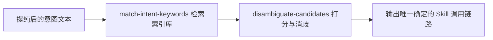

# Skill Index Router (索引控制与消歧路由)

## Overview

Skill Index Router 是管家将用户意图转化为确切 Skill 调用链路的导航中枢。
具备高命中率与自动消歧机制，确保在毫秒级内完成精准路由。

## Workflow

```mermaid
flowchart LR
    CleanIntent[提纯后的意图文本] --> Match[match-intent-keywords 检索索引库]
    Match --> Disambiguate[disambiguate-candidates 打分与消歧]
    Disambiguate --> TargetSkill[输出唯一确定的 Skill 调用链路]
```

## Boundaries

- 专职负责路由寻址与歧义裁决，不替代具体业务技能的内部实现。
