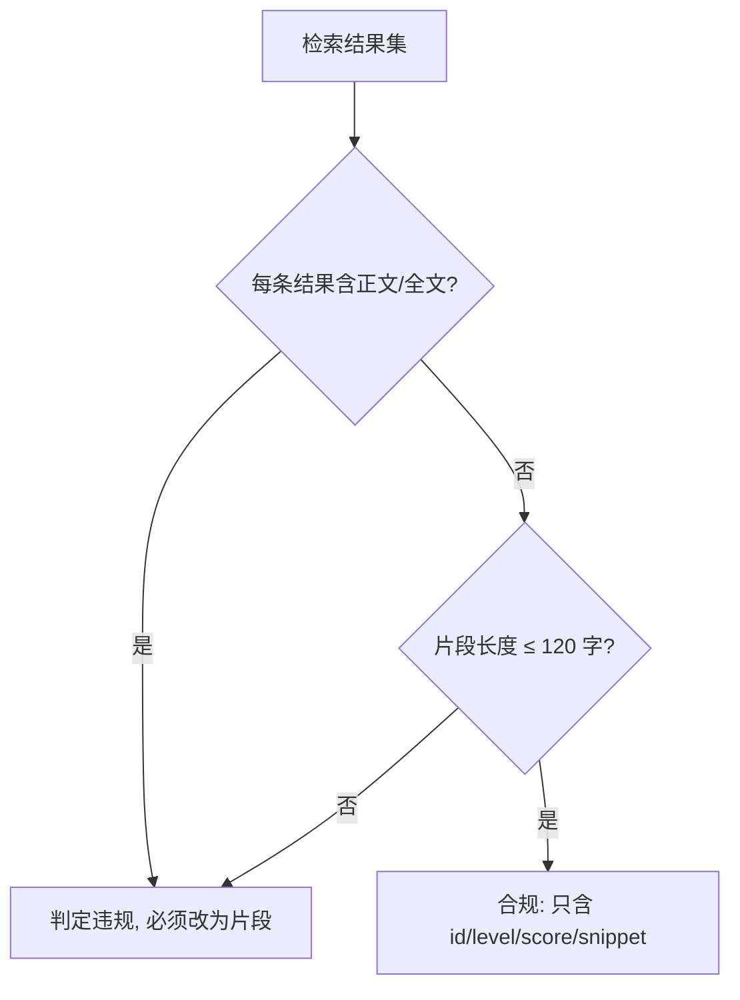

# Snippet Only Recall (仅片段回灌规约)

## Overview

本技能是 L1 原子级基础规约，是「检索替代全量加载」这条省 token 路径的守门规则。
它规定检索的**返回面**：给片段，不给全文。

## When to Use

- 设计或修改任何检索、召回、索引查询能力时；
- 审查某个检索实现是否偷偷把整份编目塞回上下文时；
- 与 `parse-query` / `rank-skills-bm25` / `emit-search-snippet` 组合使用时。

**触发禁区**：本规约只管检索返回面；「什么时候读技能正文」由 `lazy-load-policy` 管。

## Workflow

1. `[probe:regex]` 检查检索输出 JSON 是否含 `content` / `body` / `text` 之类的全文字段，命中即违规；
2. `[probe:length]` 断言每条结果的 `snippet` 长度 ≤ 120 字；
3. `[probe:regex]` 断言每条结果只含 `id` / `level` / `score` / `snippet` / `matched_terms` 等元数据字段；
4. `[probe:exitcode]` 输出合规判定，违规即返回 1。

## Strict Rules

1. **允许回灌**：技能 `id`、`level`、`score`、`snippet`（≤120 字）、`matched_terms`；
2. **禁止回灌**：`SKILL.md` 正文、`README.md` 正文、整份 `skill-catalog.json`、整份 `skill-index.json`；
3. **禁止规避**：不得以「顺手带上有用」为由附加全文；需要正文时，必须显式经 `load-skill-contract` 按需加载。

## Boundaries & Constraints

- 片段必须来自索引或 catalog 的 `description` / `triggers` / `category_title`，不得臆造；
- 本规约不限制检索条数，那是 `top-K` 的职责。
