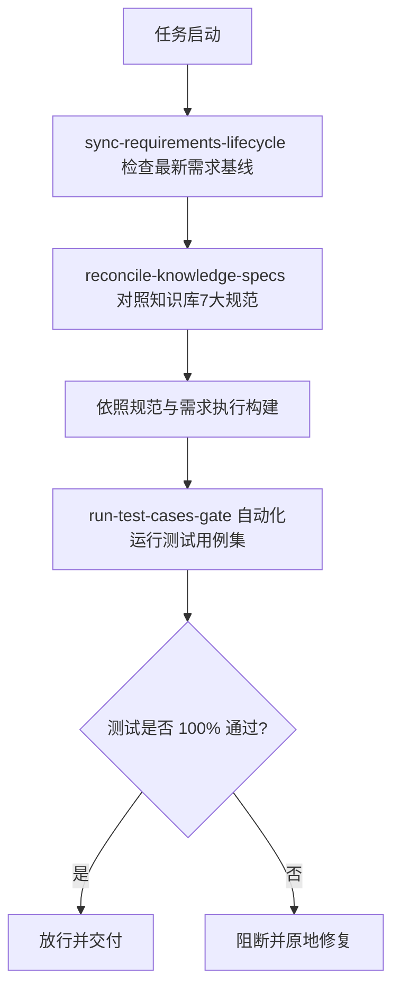

# Spec Driven Governance (需求驱动与规范仲裁总控)

## Overview

本技能是 L3 复合流程级技能。负责打通“需求同步 $\rightarrow$ 规范对照 $\rightarrow$ 执行 $\rightarrow$ 测试门禁”的完整工程闭环。

## Workflow

```mermaid
flowchart TD
    TaskStart[任务启动] --> ReqSync[sync-requirements-lifecycle 检查最新需求基线]
    ReqSync --> SpecCheck[reconcile-knowledge-specs 对照知识库7大规范]
    SpecCheck --> Execute[依照规范与需求执行构建]
    Execute --> TestGate[run-test-cases-gate 自动化运行测试用例集]
    TestGate --> Check{测试是否 100% 通过?}
    Check -->|是| Pass[放行并交付]
    Check -->|否| Block[阻断并原地修复]
```
