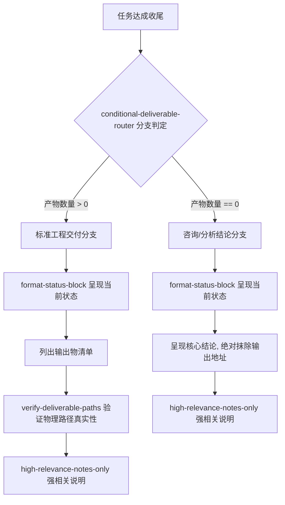

# Standard Output Framework (交付输出框架标准化总控)

## Overview

Standard Output Framework 是管家任何任务收尾交付时的唯一标准输出规范。
通过原子技能叠加与分支判定，彻底规范答复结构，消灭格式漂移与虚假空路径。

## Workflow & Structure



## Mandatory Template (强制模板)

### 分支 A：有物理产物交付
```markdown
### 一、 当前状态
【已完成】一句话完成总结。

### 二、 输出物
- `文件名/模块名`: 简要说明。

### 三、 输出地址
- `真实存在的相对或绝对路径`

### 四、 重要说明
- 紧密相关的操作指南、关键配置或验证命令。
```

### 分支 B：无物理产物交付（纯分析/咨询/自检通过）
```markdown
### 一、 当前状态
【已完成】一句话状态总结。

### 二、 核心结论
- 提炼的高浓度核心事实与分析结论。

### 三、 重要说明
- 与结论高强绑定的指导建议或后续动作。
```
