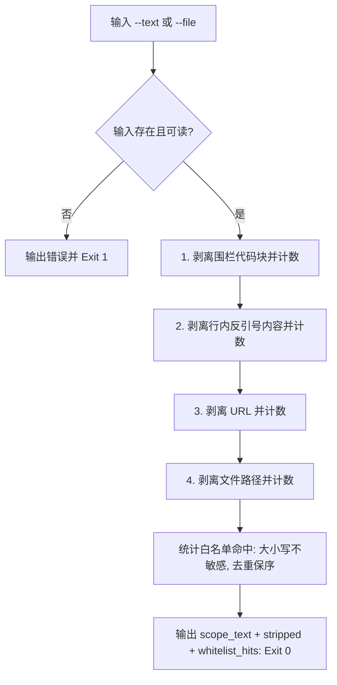

# Strip Non Prose Scope (非散文成分剥离)

## Overview

本技能是 L2 工序动作，是 `chinese-end-to-end` 规约的**判据前置**：
把一份技术交付里的**非散文成分**逐类摘掉，只留下真正该由人阅读的「待检正文」，
再交给 `verify-chinese-output` 做占比断言。

**设计前提（实测）**：本仓库技术文档的中文占比只有 25%~40%，拉丁字母几乎全是
**路径、命令、JSON 键与技能 id**。若按整体字符占比一刀切，任何一份合格的技术交付都会被判违规。
所以「纯中文」判定必须**先剥离再断言**——剥离器就是这个「先」字。

剥离顺序固定，不可交换（交换会让 URL 被误判成文件路径）：

| 序号 | 成分 | 判据 | 计数键 |
| :--- | :--- | :--- | :--- |
| 1 | 围栏代码块 | ` ``` ` 或 `~~~` 起止，含未闭合到文末的围栏 | `code_blocks` |
| 2 | 行内反引号内容 | 单反引号或双反引号包裹 | `inline_code` |
| 3 | URL | `http` / `https` / `ftp` / `mailto` 协议头 | `urls` |
| 4 | 文件路径 | 由 ASCII 路径字符与 `/` 组成、且含 ASCII 字母数字的 token | `paths` |

## When to Use

- `verify-chinese-output` 断言前，必须先由本技能产出 `scope_text`；
- 需要单独查看「一份交付里到底有多少成分被豁免」时；
- 复盘「文档中文占比为什么低」时，用四类计数定位是路径多、命令多还是真夹了英文。

**触发禁区**：纯中文明文（无代码块、无路径、无命令）不必剥离，但走本技能同样合法；
本技能只做剥离与计数，不做占比断言、不下放行结论。

## Workflow



1. `[probe:file]` 断言 `--text` 或 `--file` 至少给出一个，且 `--file` 指向的文件存在可读，否则 Exit 1；
2. `[probe:regex]` 以围栏正则剥离 ` ``` ` 与 `~~~` 代码块并计数为 `code_blocks`；
3. `[probe:regex]` 以单双反引号正则剥离行内代码并计数为 `inline_code`；
4. `[probe:regex]` 以 `http`/`https`/`ftp`/`mailto` 正则剥离 URL 并计数为 `urls`；
5. `[probe:regex]` 以含 `/` 的路径 token 正则剥离文件路径并计数为 `paths`，孤立斜杠与纯中文 token 不剥离；
6. `[probe:length]` 对剩余正文做白名单命中统计，命中项大小写不敏感、去重且保持首次出现顺序；
7. `[probe:length]` 断言 `scope_text` 与四个计数字段齐备后 Exit 0。

## Usage & Script

```bash
# 从命令行文本剥离
python3 skills/strip-non-prose-scope/scripts/strip_scope.py \
  --text "执行 python3 bin/skill-pool validate 检查，详见 https://example.com/doc 与 docs/operations/workflows.md。" --json

# 从真实文件剥离（默认输出中文摘要，不带 --json）
python3 skills/strip-non-prose-scope/scripts/strip_scope.py --file docs/operations/workflows.md

# 追加白名单（逗号分隔），让额外专有名词不被计入非白名单拉丁词
python3 skills/strip-non-prose-scope/scripts/strip_scope.py --file docs/operations/workflows.md --allow "Codex,Feishu" --json
```

## Success Contract

输出 JSON 固定为三字段：

| 字段 | 类型 | 含义 |
| :--- | :--- | :--- |
| `scope_text` | 字符串 | 剥离四类非散文成分后的待检正文 |
| `stripped` | 对象 | `{"code_blocks","inline_code","urls","paths"}` 四类剥离计数 |
| `whitelist_hits` | 数组 | 待检正文中命中的内置白名单专有名词，去重保序 |

退出码：

| 码 | 含义 |
| :--- | :--- |
| 0 | 剥离成功（结果由 stdout 承载） |
| 1 | 输入缺失（既无 `--text` 也无 `--file`），或 `--file` 文件不存在 / 不可读 |

## Boundaries & Constraints

- **顺序不可交换**：四类剥离必须按 1→4 执行，URL 必须先于路径剥离，否则 `https://x/a` 会被算成路径；
- **只剥离不修改语义**：剥离位置统一替换为空格，不删除、不改写、不翻译任何标识符原文；
- **不判不裁**：本技能不做中文占比判定，也不输出放行结论，判定权归 `verify-chinese-output`；
- **白名单只追加**：内置白名单与 `--allow` 合并，禁止用 `--allow` 删除内置项；
- **零第三方依赖**：纯 Python 3 标准库，无随机数与时间戳，同一输入产出同一结果。
