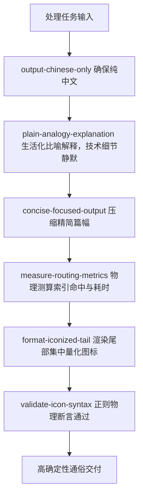

# Tail Metrics Showcase (尾部量化指标与通俗表达总控)

## Overview

本技能是 L3 复合流程级技能。整合全中文、简短聚焦、通俗比喻与量化观测，全面升级管家的用户表达体验与系统可观测性。

## Workflow

```mermaid
flowchart TD
    Req[处理任务输入] --> P1[output-chinese-only 确保纯中文]
    P1 --> P2[plain-analogy-explanation 生活化比喻解释，技术细节静默]
    P2 --> P3[concise-focused-output 压缩精简篇幅]
    P3 --> P4[measure-routing-metrics 物理测算索引命中与耗时]
    P4 --> P5[format-iconized-tail 渲染尾部集中量化图标]
    P5 --> P6[validate-icon-syntax 正则物理断言通过]
    P6 --> Deliver[高确定性通俗交付]
```
