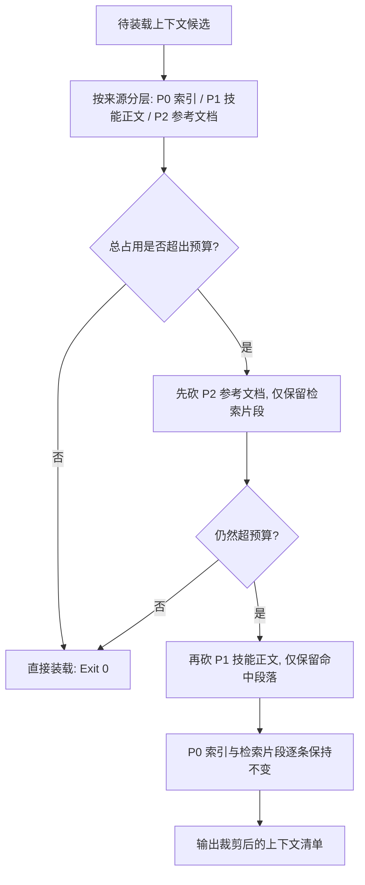

# Token Budget Policy (上下文预算与裁剪优先级规约)

## Overview

本技能是 L1 原子级基础规约，只回答一个问题：上下文窗口被占满时，先保谁、先砍谁。
它不测算、不改写、不删除：测算交 `measure-token-budget`，改写交 `prune-redundant-context`，放行交 `verify-token-reduction`。

## When to Use

- 管家准备把技能正文、Catalog 索引、docs 长文或 README 装入上下文之前；
- 上下文即将超预算，需要裁决「先砍哪一段」时；
- 新增技能或文档后，需要判断其是否允许整篇进入上下文时。

**触发禁区**：纯文件读写与不装载上下文的脚本执行不经过本规约；本规约不授权删除任何文件、不授权改动任何事实。

## Budget Priority (预算优先级)

| 优先级 | 层 | 典型来源 | 裁剪许可 |
| :--- | :--- | :--- | :--- |
| P0 | 索引 / 检索片段 | `docs/operations/skill-catalog.json`、`docs/operations/skills-index.md`、检索命中的技能片段 | **永不裁剪** |
| P1 | 选中技能正文 | 本次任务实际命中的 `skills/<name>/SKILL.md` | 超预算时可裁剪 |
| P2 | 参考文档 | `skills/<name>/references/**`、`docs/**` 长文 | 最先裁剪 |

裁剪顺序（超预算时严格按序）：**先砍 P2 参考文档 → 再砍 P1 技能正文 → P0 索引与检索片段永不砍**。
P0 的豁免是单向的：索引可以要求别层让路，任何层都不许要求索引让路。

## Hard Rules

1. **README 不进上下文**：`skills/<name>/README.md` 是人读交付说明，仅供交付与排查，不装载进模型上下文；
2. **docs 长文只以片段入上下文**：`docs/**` 任何长文必须以检索命中的片段形式进入上下文，禁止整篇装载；
3. **P0 不可缩**：索引与检索片段是寻址事实真相，裁剪它等于让路由失效；
4. **裁剪必须可复算**：每一次裁剪都要给出裁剪前后的 token 数值与等价能力证据。

## Workflow



1. `[probe:file]` 对每个候选对象确认其物理路径存在，并按 P0/P1/P2 归层；
2. `[probe:regex]` 匹配 `skills/*/README.md` 的候选，命中即从上下文装载清单中剔除；
3. `[probe:length]` 调用 `measure-token-budget` 测算各层与总占用，与预算上限做数值比较；
4. `[probe:exitcode]` 超预算时按 P2 再 P1 的次序裁剪，被调用的裁剪命令必须返回退出码 0 才允许继续；
5. `[probe:regex]` 断言裁剪后的 P0 清单与裁剪前逐条一致，杜绝索引被误砍；
6. `[probe:exitcode]` 交 `verify-token-reduction` 复算降幅与等价能力，该命令退 0 方可交付。

## Usage & Script

本技能为纯规约，无独立脚本；其物理执行由下游三个 L2 工具承载：

```bash
# 1) 先测：确认 P0 / P1 / P2 各层占用与分区合计
python3 skills/measure-token-budget/scripts/measure_tokens.py --paths docs/operations/skill-catalog.json skills/token-budget-policy/SKILL.md --json

# 2) 再裁：对候选正文做保守裁剪（受管区块逐字节不变）
python3 skills/prune-redundant-context/scripts/prune_context.py --in skills/token-budget-policy/SKILL.md --out /tmp/tbp-pruned.md --json

# 3) 放行：降幅与等价能力双断言
python3 skills/verify-token-reduction/scripts/verify_reduction.py --before skills/token-budget-policy/SKILL.md --after /tmp/tbp-pruned.md --target 0.40 --cases /tmp/token-cases.json --json
```

## Success Contract

本规约自身不含脚本，退出码语义由执行代理脚本承载：

| 退出码 | 含义 |
| :--- | :--- |
| 0 | 候选上下文全部落在预算内；或裁剪后复算通过（降幅达标且等价能力证据全部存活） |
| 1 | 超出预算且不可裁剪（P0 触顶）；或裁剪/校验脚本判定输入不可读、降幅不足、能力缺失 |
| 2 | 参数缺失（校验脚本缺 `--before` / `--after` / `--cases` 之一） |

## Boundaries & Constraints

- 本规约只输出优先级与裁剪次序裁决，不执行任何文件写入或删除动作；
- 禁止以「省 token」为名删除需求编号、`CATALOG:BEGIN/END` 受管区块、验收证据与任何事实陈述；
- 裁剪不得改变语义：只允许折叠重复，不允许改写、概括或删减首次出现的内容；
- 本规约不定义 token 计费口径，唯一口径是三个 L2 脚本共用的确定性估算公式。
