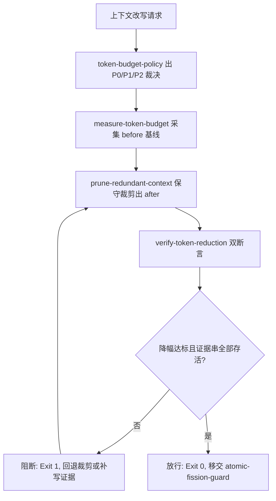

# Token Economy Guard (token 经济门禁)

## Overview

本技能是 L3 复合流程级总控，把四个原子能力串成一道门禁：
`token-budget-policy` 出优先级裁决 → `measure-token-budget` 出可复算基线 → `prune-redundant-context` 做保守裁剪 → `verify-token-reduction` 做降幅与等价能力双断言。
它挂载于管家 **「② 契约与合规」** 集群，是任何「为了省 token 而改写上下文」动作的强制前置门禁。

## When to Use

- 需求要求「token 结构性下降」（如 `REQ-BUTLER-TOKENBUDGET-018`）且需要可复算证据时；
- 任何写入类任务准备改写技能正文、Catalog 或 docs 之前，需要证明能力未被削减时；
- 上下文超预算，需要按既定裁剪顺序落地并留痕时。

**触发禁区**：只读查询、纯问答与不装载上下文的脚本执行不经过本门禁；本门禁不授权删除事实、编号、受管区块与验收证据。

## Gate Chain (门禁链条)

| 序 | 环节 | 承载技能 | 物理产物 | 不通过时 |
| :--- | :--- | :--- | :--- | :--- |
| 1 | 定规 | `token-budget-policy` | 分层裁剪裁决（P0/P1/P2） | 不进入裁剪 |
| 2 | 先测 | `measure-token-budget` | `total_tokens` / `partitions` 基线 | 退 1 阻断 |
| 3 | 裁剪 | `prune-redundant-context` | `saved_tokens` / `saved_ratio` 账 | 退 1 阻断 |
| 4 | 断言 | `verify-token-reduction` | `capability` 证据存活清单 | 退 1 阻断 |

**「同等能力」的唯一判据**：`cases.json` 中每条 case 的每个 `requires` 证据字符串在裁剪后文本中**全部存活**（`capability.missing` 为空）。
**禁止事项**：不得为了降 token 删除事实陈述、需求编号、`CATALOG:BEGIN/END` 受管区块与验收证据；裁剪只允许折叠重复，不允许改写语义。

## Workflow



1. `[probe:regex]` 由 `token-budget-policy` 裁决每个候选对象归 P0/P1/P2，断言 README 不在装载清单内；
2. `[probe:length]` 调 `measure-token-budget` 记录 `before_tokens` 与分区基线，断言数值可复算（同输入同输出）；
3. `[probe:file]` 调 `prune-redundant-context` 产出 after 文件，断言 `<!-- CATALOG:BEGIN ... -->` 至 `<!-- CATALOG:END -->` 区块逐字节不变；
4. `[probe:exitcode]` 调 `verify-token-reduction --target 0.40 --cases cases.json`，退 0 才允许进入下一步；
5. `[probe:regex]` 断言 `capability.missing` 为空数组，即以证据串全部存活作为「同等能力」判据；
6. `[probe:length]` 记录 `before_tokens`、`after_tokens`、`saved_ratio` 三值作为验收证据，缺任一即阻断；
7. `[probe:exitcode]` 门禁通过后交 `atomic-fission-guard` 做粒度门禁，二者全过方可写入。

## Usage & Script

本技能为链式门禁，无独立脚本，按序执行四个承载技能的命令：

```bash
# 1) 先测
python3 skills/measure-token-budget/scripts/measure_tokens.py --paths docs/requirements/product.md --json

# 2) 裁剪
python3 skills/prune-redundant-context/scripts/prune_context.py --in docs/requirements/product.md --out /tmp/product-pruned.md --json

# 3) 断言（cases.json 的 requires 为必须存活的证据串）
printf '%s' '{"cases":[{"id":"req-018","requires":["REQ-BUTLER-TOKENBUDGET-018","CATALOG:BEGIN"]}]}' > /tmp/token-cases.json
python3 skills/verify-token-reduction/scripts/verify_reduction.py --before docs/requirements/product.md --after /tmp/product-pruned.md --target 0.40 --cases /tmp/token-cases.json --json
```

## Success Contract

链上门禁的退出码语义（取最后一条未通过的命令的退出码）：

| 退出码 | 含义 |
| :--- | :--- |
| 0 | 降幅达标且 `capability.missing` 为空，门禁放行 |
| 1 | 降幅不足、能力证据缺失、输入不可读，或受管区块被改动 |
| 2 | 参数/文件缺失（校验脚本缺 `--before` / `--after` / `--cases`，或 `cases.json` 结构非法） |

## Boundaries & Constraints

- 门禁只做**阻断与证据输出**，不自动改写他人技能契约；
- 裁剪必须保守且语义无损：任何「概括、改写、删除首次出现内容」的省 token 手段一律违规；
- 受管区块、需求编号、表格行与验收证据是事实真相，**不参与裁剪**；
- 证据串覆盖不足不是放行理由：缺证据即阻断，由作者补齐 `cases.json` 后重跑。
