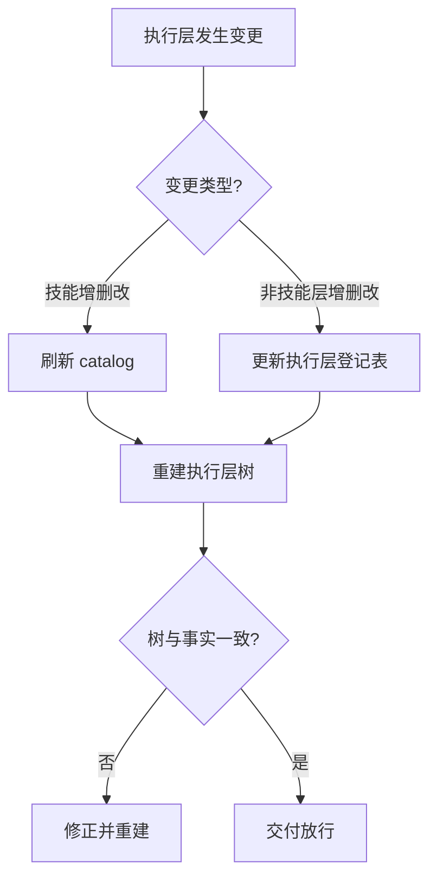

# Tree Update Mandatory (树与索引同步强制规约)

## Overview

本技能是 L1 原子级基础规约，规定「改完能力必须改树」是**交付的一部分**，而不是可选的收尾动作。
执行层树是管家分派下属的地图；地图不更新，等于新增的能力不存在。

## When to Use

- 新增、删除或修改任何执行层条目（技能、命令、智能体、接口、协议、插件）之后；
- 修改任一技能的 `level` / `composition` / 集群归属之后；
- 审查某次交付是否"改了能力但没改树"时。

**触发禁区**：只读查询与纯文档润色不触发本规约；本规约不替代 `catalog-consistency-guard` 的口径对拍。

## Workflow

1. `[probe:file]` 断言 `docs/operations/skill-catalog.json` 与 `docs/operations/execution-tree.json` 均存在且非空；
2. `[probe:regex]` 检查变更路径是否落在执行层内（`skills/**`、`bin/**`、登记表中的 path）；
3. `[probe:exitcode]` 重建执行层树，退出码必须为 0；
4. `[probe:exitcode]` 运行树一致性断言，退出码必须为 0；
5. `[probe:exitcode]` 任一步失败即判定「能力改了、树没改」，禁止交付。

## Strict Rules

1. **同步是交付前置**：树与索引刷新失败，等同于交付失败；
2. **禁止手写树**：集群归属与层级关系一律以 `execution-tree.json` 为准，文档中的展示必须来自受管区块；
3. **新增层要登记**：出现新的执行层形态（例如第一次引入插件）时，必须先登记层定义再挂条目。

## Boundaries & Constraints

- 本规约约束的是「树与事实一致」，不约束树的具体排版；
- 宿主提供的能力（如 `subagent`）以 `source=host` 登记，不需要仓库内路径。
