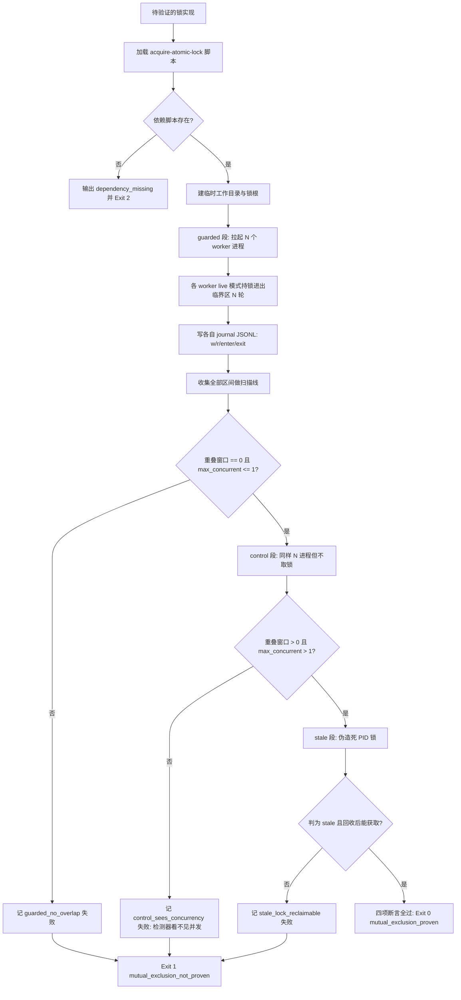

# Verify Atomic Mutual Exclusion (原子锁互斥性物理压测断言器)

## Overview

本技能回答一个只能用实验回答的问题：**「装了锁之后，多处同时处理真的被互斥了吗？」**

静态读代码回答不了。一份写得很漂亮的加锁代码，只要载体不是内核原子原语、
或释放路径漏了一条、或陈旧锁不可回收，互斥就会在某个时间窗里静默失效。
所以本技能不读代码，**真的拉起进程去抢**。

它产出三段证据，缺一不可：

| 段 | 做什么 | 必须满足 |
| :--- | :--- | :--- |
| `guarded` | N 个独立进程并发抢同一把锁，各自记录临界区 `enter` / `exit` 时间戳 | 扫描线算出**重叠窗口 = 0** 且**任一瞬间持有者 ≤ 1**，且 N × rounds 次临界区**全部完成** |
| `control` | 同样 N 个进程、同样临界区驻留时长，但**不取锁** | 重叠窗口 **> 0** 且最大持有者 **> 1** |
| `stale` | 伪造一把「持有者 PID 已不存在」的锁 | `status` 判 `stale` 且 `acquire` 能回收后成功获取 |

**为什么必须有 `control` 段**：一个永远输出「0 重叠」的检测器，在真正互斥和完全没锁两种情况下
给出同样的结论——那种 0 是**假阴性**，不能作为证据。只有当场证明「同一个检测器在不加锁时确实看见了并发」，
持锁段的 0 才具备证明力。这是本技能与「打印一句 success」的本质区别。

## When to Use

- 交付前需要给出「多处同时处理已被物理互斥」的**可复算证据**时；
- 修改了锁实现（换了载体、改了释放路径、改了陈旧判据）后需要回归验证时；
- 怀疑某次并发写入互相覆盖，需要先证明或证伪锁的有效性时。

**触发禁区**：只读并发不需要互斥证据；本技能只压测、不改写业务文件、不修改被测锁实现；
单进程内线程锁的互斥性不由本技能负责（本技能压的是跨进程）。

## Workflow



1. `[probe:file]` 加载 `skills/acquire-atomic-lock/scripts/atomic_lock.py`，文件不存在即输出 `dependency_missing` 并退 2（**绝不内置兜底锁实现**，否则测的不是被测对象）；
2. `[probe:length]` 断言 `--workers ≥ 2` 且 `--rounds ≥ 1`：单进程构不成并发，直接退 2；
3. `[probe:file]` 建临时工作目录与锁根，为每个 worker 分配独立 journal 文件路径；
4. `[probe:exitcode]` `guarded` 段：拉起 `--workers` 个独立子进程，每个进程 `rounds` 轮「`acquire`（`live` 模式）→ 记录 `enter` → 驻留 `hold_ms` → 记录 `exit` → `release`」，逐行写自己的 journal JSONL；
5. `[probe:length]` 收集全部区间做扫描线：按时间排序后统计最大同时持有者数 `max_concurrent_holders` 与重叠窗口数 `overlap_windows`（进入时已有其他持有者即计一次）；
6. `[probe:exitcode]` 断言 `guarded_no_overlap`：`overlap_windows == 0` 且 `max_concurrent_holders <= 1`，否则判互斥被证伪；
7. `[probe:exitcode]` 断言 `guarded_all_acquired`：完成临界区数等于 `workers × rounds`，且无 worker 非零退出、无 journal 缺失；
8. `[probe:exitcode]` `control` 段：同样 N 进程、同样 `hold_ms`，但**不取锁**，断言 `overlap_windows > 0` 且 `max_concurrent_holders > 1`；不满足即判检测器失效，持锁段的 0 作废；
9. `[probe:exitcode]` `stale` 段：在锁根下伪造一把 `pid` 不存在、`mode: live` 的锁，断言 `classify_stale` 判真且 `acquire` 能回收后成功获取（口径⑥的正向验证）；
10. `[probe:exitcode]` 汇总四项断言：全 `pass` 输出 `verdict: mutual_exclusion_proven` 并退 0，任一失败输出 `mutual_exclusion_not_proven` 并退 1；无论成败都清理临时目录。

## Input Contract

| 参数 | 口径 |
| :--- | :--- |
| `--workers` | 并发进程数，默认 16；< 2 即退 2 |
| `--rounds` | 每进程临界区轮次，默认 20；< 1 即退 2 |
| `--hold-ms` | 临界区驻留毫秒，默认 5；设为 0 会显著降低重叠检出灵敏度 |
| `--timeout` | 单次等待/持有上限秒数，默认 60 |
| `--lock-root` | 锁根目录，缺省用临时目录（测完即删） |
| `--skip-control` | 跳过无锁负向对照段（不建议：跳过即丧失假阴性排除能力） |

## Usage & Script

```bash
# 标准压测：16 进程 × 20 轮，含无锁对照段
python3 skills/verify-atomic-mutual-exclusion/scripts/verify_mutual_exclusion.py \
  --workers 16 --rounds 20 --hold-ms 5 --json

# 快速回归
python3 skills/verify-atomic-mutual-exclusion/scripts/verify_mutual_exclusion.py \
  --workers 8 --rounds 5 --hold-ms 3 --json
```

实测输出（16 进程 × 20 轮）：

| 段 | 重叠窗口 | 最大同时持有者 | 完成临界区 |
| :--- | ---: | ---: | ---: |
| `guarded`（持锁） | **0** | **1** | 320 / 320 |
| `control`（不持锁） | **318** | **17** | 320 / 320 |

## Success Contract

| 退出码 | 含义 |
| :--- | :--- |
| 0 | 四项断言全过，`verdict = mutual_exclusion_proven`：互斥已被物理证明 |
| 1 | 任一断言失败，`verdict = mutual_exclusion_not_proven`：重叠非零 / 有 worker 异常 / 对照段看不见并发 / 陈旧锁不可回收 |
| 2 | 输入不可读（依赖脚本缺失、`--workers < 2`、`--rounds < 1`、锁根不可写、worker 启动失败） |

JSON 契约：`{"success","verdict","workers","rounds","hold_ms","lock_root","guarded":{...},"control":{...},"stale":{...},"checks":[...]}`；
`checks[].name` 取值闭集为 `guarded_no_overlap` / `guarded_all_acquired` / `control_sees_concurrency` / `stale_lock_reclaimable`。

## Boundaries & Constraints

- **不改被测对象**：本技能只调用 `acquire-atomic-lock` 的公开接口，不 monkey-patch、不替换其内部实现；
- **依赖缺失即退 2，绝不内置兜底锁**：兜底实现会让「测的不是被测对象」，得到无意义的 0；
- **负向对照不可省**：跳过 `control` 段后，0 重叠不再构成证据；`--skip-control` 仅供极速冒烟，不得用于交付验收；
- **只读业务、只写临时目录**：journal 与锁根都在临时目录，测完即删，不触碰任何业务文件；
- **不改写任何受管区块**：本技能不生成 catalog / tree / 索引内容；
- **确定性**：时间戳必然随机器负载浮动，但**判定结果**（重叠 0 / 非 0）在正确实现与错误实现下稳定分离；本技能不断言具体耗时。
