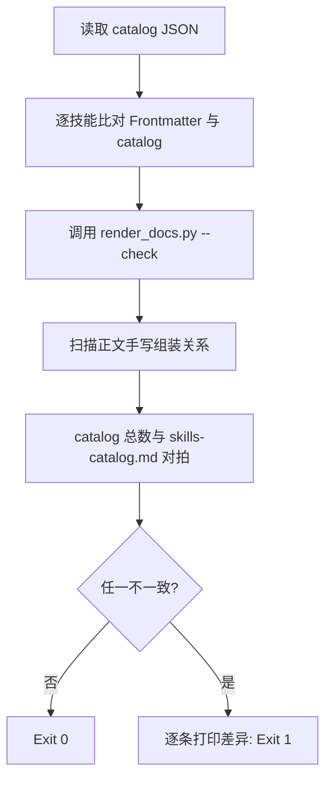

# Verify Catalog Consistency (口径三方对拍探针)

## Overview

本技能是 L2 工序动作级探针，专门捕捉「文档写的」与「技能声明的」不一致。
它不修任何东西，只回答一个问题：现在有没有漂移？有的话在哪一行。

## When to Use

- 任何技能的新增、修改、删除之后；
- 交付前作为口径门禁运行；
- 怀疑文档落后于技能实际契约时。

**触发禁区**：只读问答不触发；本探针不做自动修复。

## Workflow



1. `[probe:file]` 断言 `docs/operations/skill-catalog.json` 与 `docs/operations/skills-catalog.md` 存在且非空；
2. `[probe:exitcode]` 逐技能比对 `SKILL.md` 的 `name` / `level` / `composition` 与 catalog 条目，不一致即失败；
3. `[probe:exitcode]` 调用 `render_docs.py --check`，受管区块落后即失败；
4. `[probe:regex]` 扫描 docs 正文形如 `` `skill` (L3) = `a` + `b` `` 的手写组装行，与 catalog 对拍，不一致即失败；
5. `[probe:regex]` 断言 `skills-catalog.md` 的总纳管技能数与 catalog `total_skills` 一致。

## Usage & Script

```bash
python3 skills/verify-catalog-consistency/scripts/verify_consistency.py
python3 skills/verify-catalog-consistency/scripts/verify_consistency.py --json
```

## Success Contract

- Exit Code 0：四方（Frontmatter / catalog / 受管区块 / 正文手写表）完全一致；
- Exit Code 1：存在任一不一致，stdout 必含 `issues` 数组，每项含文件、行号与原因。

## Boundaries & Constraints

- 只读探针，绝不自动改写文件；修复动作交 `render-catalog-docs` 或人工；
- 对 `@system/*` 系统技能不做 Frontmatter 比对（其契约不在本仓库）。
