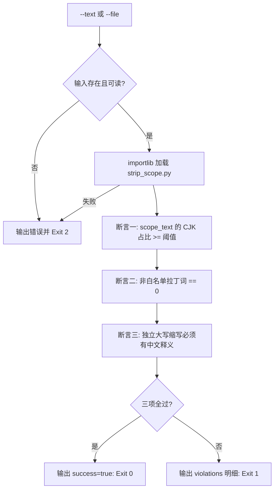

# Verify Chinese Output (中文输出三项硬断言)

## Overview

本技能是 L2 工序动作，是「全流程中文输出」规约的**放行闸门**：
剥离器不自证合规，合格与否由本门禁对 `scope_text` 逐项断言。

**设计前提（实测）**：本仓库技术文档的中文占比只有 25%~40%，拉丁字母几乎全是
**路径、命令、JSON 键与技能 id**。所以断言**必须建立在 `strip-non-prose-scope` 剥离后的
待检正文之上**，按整体字符占比一刀切会让任何一份合格的技术交付都违规。

三项断言（**全部通过才 Exit 0**）：

| 序号 | 断言名 | 判据 | 说明 |
| :--- | :--- | :--- | :--- |
| 1 | `cjk_ratio` | 待检正文 CJK 占比 ≥ `--min-cjk-ratio`（默认 0.85） | 分母为非空白、非标点、非符号字符 |
| 2 | `no_latin_word` | 非白名单拉丁词数量 == 0 | **严格档，无宽容参数** |
| 3 | `abbr_gloss` | 独立大写缩写必须有中文释义 | 子判据甲：后 12 字内无中文即违规（每次出现都查）；子判据乙：同一缩写首次出现必须带中文释义结构 |

**白名单只豁免断言 2，不豁免断言 3**：`MCP` 是内置白名单词，但「使用 MCP 完成数据同步」仍然违规，
因为它没给出中文全称「模型上下文协议（MCP）」。

## When to Use

- 交付前门禁：`chinese-output-guard` 流水线的末端断言；
- 复核一份回复草稿是否真的「全流程中文」，而不是看着像中文；
- 定位既有文档的中文占比缺口，决定改哪一段。

**触发禁区**：纯代码块、纯命令行、纯 JSON 载荷的交付不跑本门禁——它们是规约的豁免面，
不属于「散文」判定对象；本门禁也不评价内容对错，只判语言形态。

## Workflow



1. `[probe:file]` 断言 `--text` 或 `--file` 至少给出一个，且 `--file` 指向的文件存在可读，否则 Exit 2；
2. `[probe:exitcode]` 用 importlib 直接加载 `skills/strip-non-prose-scope/scripts/strip_scope.py`，加载失败 Exit 2，禁止起子进程；
3. `[probe:length]` 断言一：`scope_text` 的 CJK 占比 ≥ `--min-cjk-ratio`（默认 0.85），不达标记 `kind=cjk_ratio`；
4. `[probe:regex]` 断言二：逐个拉丁词 token 与白名单对拍，非白名单词必须为 0 个，命中记 `kind=latin_word`；
5. `[probe:regex]` 断言三：匹配「≥2 连续大写字母」的独立缩写，后 12 字内无中文即违规，且首次出现必须带中文释义结构，命中记 `kind=abbr_no_gloss`；
6. `[probe:exitcode]` 三项全过 Exit 0；任一违规输出 `kind` / `token` / `index` / `snippet` 并 Exit 1。

## Usage & Script

```bash
# 合规样本：中文技术说明 + 一段代码块 + 若干路径，应 Exit 0
python3 skills/verify-chinese-output/scripts/verify_chinese.py \
  --text '本规约要求交付正文一律使用中文书写。技术标识符保留原文，但首次出现必须紧跟中文释义。模型上下文协议（MCP）就是这样的写法，它的详细说明见 skills/chinese-end-to-end/SKILL.md。' --json

# 违规样本：中文里夹整句英文，应 Exit 1 且 violations 含 latin_word 与位置
python3 skills/verify-chinese-output/scripts/verify_chinese.py \
  --text '本工具用于校验输出。The output is generated by the tool. 请检查。' --json

# 真实文档整篇判定：代码块与命令原文自动豁免（允许 Exit 1，如实报告即可）
python3 skills/verify-chinese-output/scripts/verify_chinese.py \
  --file docs/operations/workflows.md --json

# 收紧阈值与追加白名单
python3 skills/verify-chinese-output/scripts/verify_chinese.py \
  --file docs/operations/workflows.md --min-cjk-ratio 0.9 --allow "Codex,Feishu" --json
```

## Success Contract

输出 JSON 固定为五字段：

| 字段 | 类型 | 含义 |
| :--- | :--- | :--- |
| `success` | 布尔 | 三项断言是否全部通过 |
| `cjk_ratio` | 数字 | 待检正文 CJK 占比，保留四位小数 |
| `scope_len` | 整数 | 待检正文字符数 |
| `violations` | 数组 | `[{"kind","token","index","snippet"}]`，`kind` 取 `latin_word` / `cjk_ratio` / `abbr_no_gloss` |
| `checks` | 数组 | `[{"name","pass","detail"}]` 三项断言的逐项判定 |

其中 `index` 为字符偏移量；`kind=cjk_ratio` 属全文级违规，`index` 固定为 `-1`。

退出码：

| 码 | 含义 |
| :--- | :--- |
| 0 | 三项断言全部通过 |
| 1 | 存在违规（占比不达标 / 非白名单拉丁词 / 缩写无中文释义） |
| 2 | 输入缺失、文件不存在不可读，或剥离器不可用 |

## Boundaries & Constraints

- **严格档无宽容**：断言 2 没有 `--tolerant` 之类的口子，白名单之外的拉丁词一律违规；
- **白名单不豁免释义**：白名单只解决「词能不能出现」，缩写是否给中文全称由断言 3 独立判定；
- **占比口径固定**：分母为待检正文中非空白、非标点、非符号的字符数，禁止临时改口径凑通过；
- **零子进程**：剥离器以 importlib 进程内加载，禁止用子进程绕过加载失败；
- **判定确定性**：同一输入必须得到同一结论，不引入随机数与时间戳。
