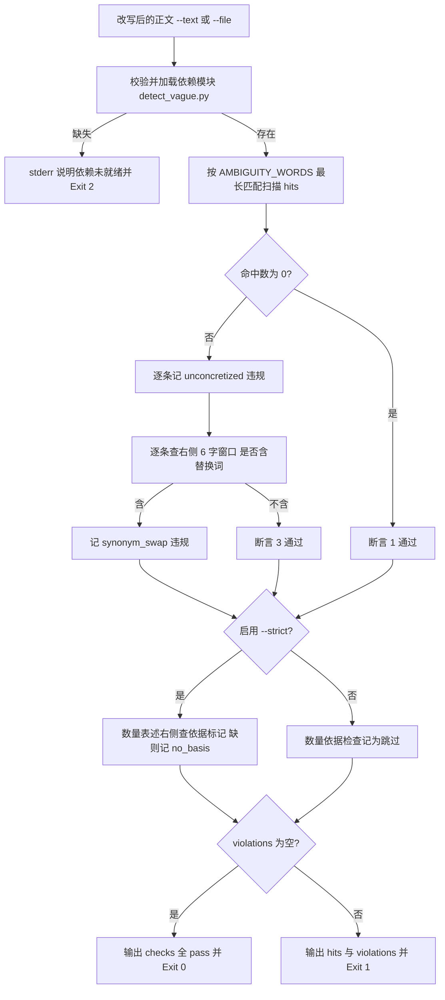

# Verify Concretized Output (含糊词具像化断言器)

## Overview

本技能是「含糊其辞必须具像化」（`REQ-BUTLER-CONCRETIZE-024`）流水线的**断言环节**：
对改写后的正文给出 `0 / 1` 裁决。三项断言**全过才放行**，任一条不成立即退 `1`。

| # | 断言名 | 判据 | 违规 kind |
| :--- | :--- | :--- | :--- |
| 1 | `no_unconcretized` | `AMBIGUITY_WORDS` 命中数 == 0 | `unconcretized` |
| 2 | `quantity_basis`（`--strict`） | 任何数量表述必须带依据，如 `12 个（依据：…）` | `no_basis` |
| 3 | `no_synonym_swap` | 命中词右侧 6 字内不得出现替换词 | `synonym_swap` |

第 3 条是「**禁止用另一个含糊词替换含糊词**」的物理判据：
「请尽快处理，尽早反馈」中，「尽快」右侧 6 字窗口（`处理，尽早反`）里出现「尽早」，
即判 `synonym_swap`；改成「在下一个门禁运行前（≤10 分钟）反馈」才放行。
替换词按三级判定，**全部以依赖模块为权威、不引入任何词条**：

1. 词表内其它同类别含糊词（`classify_word` 判为同类别）；
2. 窗口内 2~4 字切片经 `classify_word` 判为同类别者（覆盖未登记但可分类的邻词）；
3. **换字变体**：与命中词等长、逐位比较仅一个汉字不同、其余位置完全相同
   （「尽快」→「尽早」是中文同义替换的典型词形；该规则由命中词在运行期推导，不是第二份词表）。

第 2 条只在 `--strict` 下生效：非严格模式下该检查记为通过并在 `detail` 中说明「未启用」，
避免默认把只做实体枚举、不含数量的正文误杀。

**词表唯一真相源**：`AMBIGUITY_WORDS` 与 `classify_word(w)` 只从
`skills/detect-vague-modifier/scripts/detect_vague.py` 经 `importlib` 加载，本脚本不内置词表。

## When to Use

- 交付前，断言交付正文里的含糊词已全部具像化（`hits == 0`）时；
- 复审一次改写「是不是只是换了个同义词」，需要机器给 `synonym_swap` 证据时；
- 门禁链路（`concretization-guard`）中作为最后一环，给放行/阻断提供退出码时。

**触发禁区**：本技能只断言、不改写；正文尚未改写时不要用它代替 `concretize-term` 的建议环节，也不要把它当作反例库或词表查询工具。

## Workflow



1. `[probe:file]` 断言词表唯一真相源 `skills/detect-vague-modifier/scripts/detect_vague.py` 存在，缺失或不可加载即 `exit 2` 并写明依赖未就绪；
2. `[probe:regex]` 用 `AMBIGUITY_WORDS` 做最长匹配扫描得到 `hits`，命中数非 0 即逐条记 `unconcretized`；
3. `[probe:regex]` 对每条命中取其右侧 6 字窗口，按三级判定查替换词（词表内同类别词、窗口切片经 `classify_word` 判为同类别者、等长同位仅差一字的换字变体），命中即记 `synonym_swap`；
4. `[probe:regex]` `--strict` 时对每个数量表述取其右侧 30 字查「依据：」标记，未出现即记 `no_basis`，已带依据的数量区间做占用标记避免级联误判；
5. `[probe:length]` 汇总 `checks` 三项并断言 `violations` 数组长度，长度为 0 才允许放行；
6. `[probe:exitcode]` 全过退 `0`、有违规退 `1`、依赖未就绪或输入缺失退 `2`。

## Usage & Script

```bash
# 默认断言：不含未具像化含糊词 + 无同义替换
python3 skills/verify-concretized-output/scripts/verify_concretized.py \
  --text '本次扫描命中 12 处（依据：全仓 12 个脚本静态扫描结果）' --json

# 严格断言：额外要求任何数量表述带依据
python3 skills/verify-concretized-output/scripts/verify_concretized.py \
  --text '本次扫描命中 12 处' --strict --json          # → no_basis，exit 1

# 同义替换样本：必须 exit 1 且含 synonym_swap
python3 skills/verify-concretized-output/scripts/verify_concretized.py \
  --text '请尽快处理，尽早反馈' --json                   # → synonym_swap，exit 1

# 文件输入
python3 skills/verify-concretized-output/scripts/verify_concretized.py --file <交付稿> --strict --json
```

输出示例（片段）：

```json
{
  "success": false,
  "strict": false,
  "hits": [{"term": "尽快", "category": "timing", "line": 1, "snippet": "请尽快处理，尽早反馈"}],
  "violations": [
    {"kind": "unconcretized", "term": "尽快", "line": 1, "detail": "命中未具像化的含糊词「尽快」（类别 timing）"},
    {"kind": "synonym_swap", "term": "尽快", "line": 1, "other_term": "尽早", "detail": "「尽快」右侧 6 字内出现替换词「尽早」（判定依据：换字变体），属同义替换"}
  ],
  "checks": [
    {"name": "no_unconcretized", "pass": false, "detail": "含糊词命中数 1（要求 0）"},
    {"name": "quantity_basis", "pass": true, "detail": "未启用 --strict，默认不校验数量依据"},
    {"name": "no_synonym_swap", "pass": false, "detail": "同义替换违规 1 处（要求 0）"}
  ]
}
```

## Success Contract

输出 JSON 字段：

| 字段 | 类型 | 含义 |
| :--- | :--- | :--- |
| `success` | 布尔 | 三项断言全过且 `violations` 为空 |
| `strict` | 布尔 | 是否启用 `--strict` |
| `source` | 字符串 | `text`，或实际读取的文件路径 |
| `hits[]` | 数组 | 命中的含糊词：`term` / `category` / `line` / `snippet` |
| `violations[]` | 数组 | 违规：`kind`（`unconcretized` / `no_basis` / `synonym_swap`）/ `term` / `line` / `detail`；`synonym_swap` 额外带 `other_term`（替换词） |
| `checks[]` | 数组 | 三项断言：`name` / `pass` / `detail` |

退出码：

| 码 | 含义 |
| :--- | :--- |
| 0 | 三项断言全过（`success: true`） |
| 1 | 存在违规：`unconcretized` / `no_basis` / `synonym_swap` 任一命中 |
| 2 | 依赖模块 `detect-vague-modifier` 未就绪，或输入缺失（未给 `--text` / `--file`、文件不可读或为空） |

## Boundaries & Constraints

- **只断言不改写**：本技能不产出替换建议（那是 `concretize-term` 的职责），不写任何文件，加载依赖时不写 `.pyc`（`sys.dont_write_bytecode`）；
- **禁止内置兜底词表**：依赖缺失一律 `exit 2`；换字变体规则由命中词在运行期推导，不含任何词条；
- **禁止放宽判据**：命中数必须严格为 0，`synonym_swap` 命中不得以「语义相近」为由豁免；
- **`--strict` 才查依据**：非严格模式跳过 `no_basis` 并在 `detail` 明示，禁止静默改变口径；
- **确定性**：无随机数、无系统时间、无网络，同一输入连跑两次产出同一 JSON；
- **不越界**：程度词的数值化是否达标由 `verify-quantified-output` 一线判定，本技能只管含糊词具像化。
