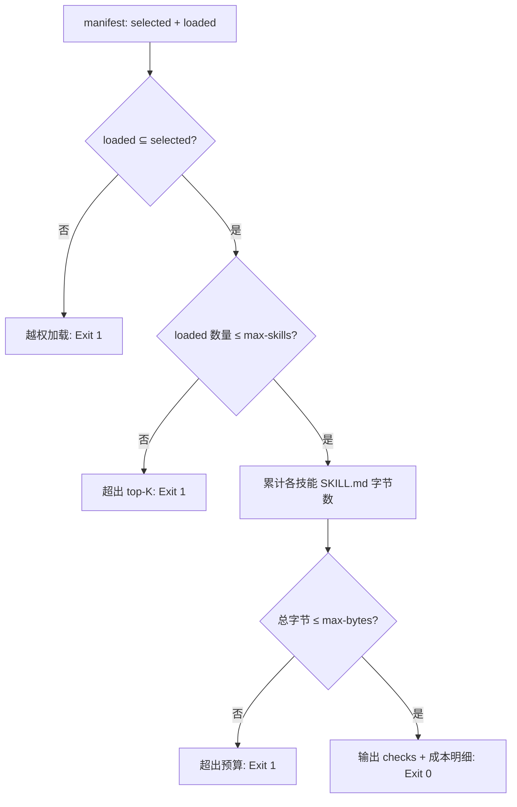

# Verify Context Payload (上下文载荷预算断言)

## Overview

本技能是 L2 工序动作级探针，回答一个具体问题：这次到底往上下文里塞了多少技能正文？
它把 `lazy-load-policy` 的四条硬规则变成可执行的断言。

## When to Use

- 一次按需加载完成后、进入执行之前；
- 怀疑某个流程偷读了未选中技能时；
- 需要向用户汇报「本次上下文成本」时。

**触发禁区**：只读断言，不负责加载也不负责裁剪。

## Workflow



1. `[probe:file]` 读取 manifest（或 `--selected` / `--loaded` 参数），断言两者均非空数组；
2. `[probe:regex]` 断言 `loaded` 是 `selected` 的子集，任一越权项即失败；
3. `[probe:length]` 断言 `len(loaded) ≤ --max-skills`（默认 5）；
4. `[probe:file]` 逐项 stat `skills/<id>/SKILL.md` 并累计字节，断言总和 ≤ `--max-bytes`（默认 12288）；
5. `[probe:exitcode]` 输出 `checks` 与成本明细后返回 0/1。

## Usage & Script

```bash
python3 skills/verify-context-payload/scripts/verify_payload.py --selected a,b,c --loaded a,b
python3 skills/verify-context-payload/scripts/verify_payload.py --manifest /tmp/manifest.json
```

## Success Contract

- Exit Code 0：四项断言全部通过；
- Exit Code 1：越权加载、超出 top-K、超出字节预算，或目标文件缺失；
- 输出必含 `checks` 数组与 `total_bytes` / `total_tokens`，便于事后审计。

## Boundaries & Constraints

- 只统计技能正文（`SKILL.md`），不计 `README.md` 与脚本；
- 不允许把「反正没超太多」作为放行理由。
