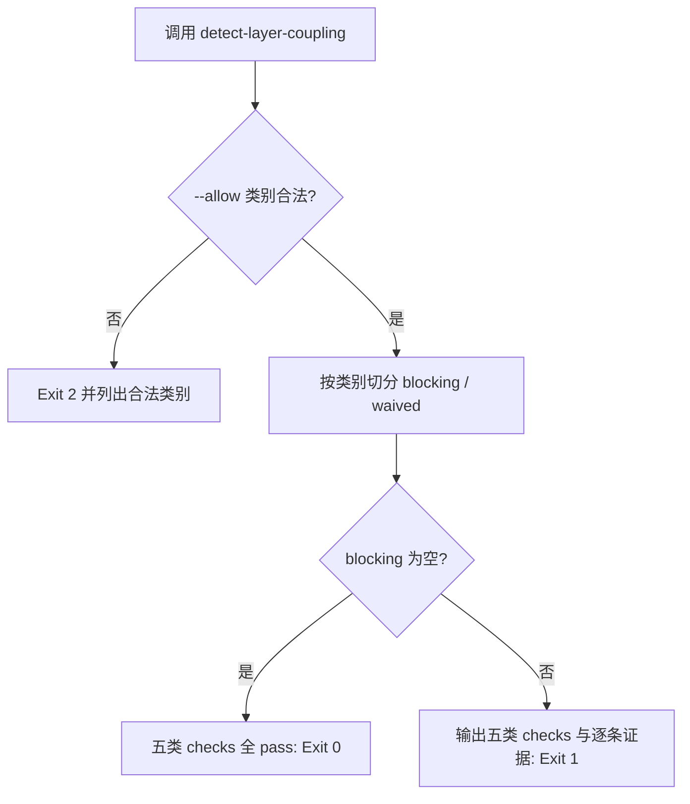

# Verify Decoupling (解耦零违规断言)

## Overview

本技能是 L2 工序动作级探针，把检测结果变成**可放行的断言**。
它最关键的纪律是：豁免必须**显式、可按类别、且留痕**——不允许"这条先跳过"这种口头豁免。

## When to Use

- 执行层技能新增或改动之后的交付前置；
- 与 `execution-tree-guard` 并列的结构门禁（一个管层级归属，一个管依赖合法性）；
- 存量违规需要分批治理、必须临时豁免时。

**触发禁区**：只读断言，不修复；修复是补 `composition` 或补 `[shared-resource]` 标记。

## Workflow



1. `[probe:regex]` 校验 `--allow` 中的每个类别都在五类白名单内，出现未知类别即退出 2；
2. `[probe:file]` 断言检测器脚本存在于 `<root>/skills/detect-layer-coupling/scripts/detect_coupling.py`；
3. `[probe:exitcode]` 进程内加载检测器并取得违规清单（不重复实现判据）；
4. `[probe:length]` 按 `--allow` 把违规切成 `waived` 与 `blocking` 两组，`blocking_count` 决定成败；
5. `[probe:exitcode]` 五类 checks 逐类给出通过与否，全过返回 0。

## Usage & Script

```bash
python3 skills/verify-decoupling/scripts/verify_decoupling.py
python3 skills/verify-decoupling/scripts/verify_decoupling.py --allow shared_mutable_state
python3 skills/verify-decoupling/scripts/verify_decoupling.py --root /tmp/fakerepo
```

## Success Contract

- Exit Code 0：`blocking_count == 0`（豁免项单独计入 `waived`，不被隐藏）；
- Exit Code 1：存在未豁免违规，输出含五类 `checks` 与逐条证据；
- Exit Code 2：`--allow` 含未知类别，或检测器/输入缺失。

## Boundaries & Constraints

- **豁免必须留痕**：`waived` 数组会原样出现在输出里，任何人可复算豁免了哪几条；
- 本技能不修改任何文件。
