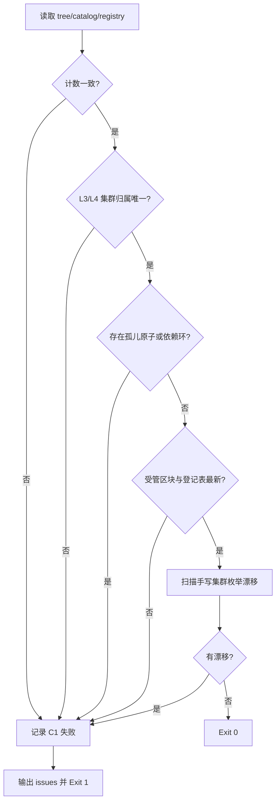

# Verify Execution Tree (执行层树一致性断言)

## Overview

本技能是 L2 工序动作级探针，回答一个问题：**树的说法和事实是否一致**。
它同时扫掉「文档里手写一份集群表」这类结构漂移——这正是口径漂移的同族病。

## When to Use

- 执行层树重建之后、交付之前；
- 怀疑某份文档里的集群结构与实际不符时；
- 新增执行层条目后确认它确实进了树时。

**触发禁区**：只读断言，不修复；修复由 `build-execution-tree` 或人工完成。

## Workflow



1. `[probe:file]` 断言 `execution-tree.json`、`skill-catalog.json`、`execution-layers.json` 三者存在且非空；
2. `[probe:regex]` 校验树中的 `cluster_map` 覆盖全部 L3 技能且每个 L3 恰属一个集群（L4 是树根，不参与集群归属）；
3. `[probe:exitcode]` 断言 `issues` 中不含 `orphan_atom` / `composition_cycle` / `missing_dependency`；
4. `[probe:exitcode]` 运行 `build-execution-tree --check`，受管区块或产物陈旧即失败；
5. `[probe:regex]` 扫描 `skills/**/*.md` 与 `docs/requirements/*.md`，在受管区块之外查找同时含 ≥3 个集群标记的手写枚举行，报文件与行号；
6. `[probe:exitcode]` 输出 `checks` 与 `issues` 后返回 0/1。

## Usage & Script

```bash
python3 skills/verify-execution-tree/scripts/verify_tree.py
python3 skills/verify-execution-tree/scripts/verify_tree.py --json
```

## Success Contract

- Exit Code 0：六项检查全部通过；
- Exit Code 1：任一项失败，输出必含 `issue` 的文件路径与行号（漂移类）或对象 id（结构类）。

## Boundaries & Constraints

- 只读探针，绝不自动改写文件；
- 手写集群枚举的判定阈值是「同一行出现 ≥3 个集群标记」，避免误伤正常的单集群引用。
