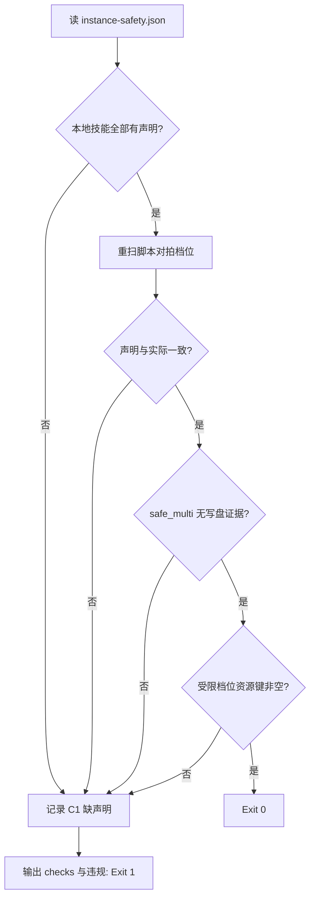

# Verify Instance Safety (实例安全声明断言)

## Overview

本技能是 L2 工序动作级探针，回答「声明表还能不能信」。
声明一旦写出就会过期——脚本改一行，声明就可能变成假话，所以每次并行派发前都要重扫对拍。

## When to Use

- 并行派发之前的准入断言；
- 修改过任何执行层脚本之后；
- 定期体检声明表是否已陈旧时。

**触发禁区**：只读断言，不刷新声明表；刷新由 `classify-instance-safety --write` 负责。

## Workflow



1. `[probe:file]` 断言 `docs/operations/instance-safety.json` 存在且可解析；
2. `[probe:regex]` 对比 catalog 的本地技能清单与声明表条目标识，找出缺失项；
3. `[probe:exitcode]` 调用 `classify-instance-safety` 重扫，逐技能比对档位是否与声明一致（防陈旧）；
4. `[probe:regex]` 断言声明为 `safe_multi` 的技能**没有写盘信号**（档位与证据矛盾即失败）；
5. `[probe:length]` 断言 `needs_lock` / `single_only` 的 `resource_keys` 非空，随后返回 0/1。

## Usage & Script

```bash
python3 skills/verify-instance-safety/scripts/verify_instance_safety.py
python3 skills/verify-instance-safety/scripts/verify_instance_safety.py --json
```

## Success Contract

- Exit Code 0：四项断言全部通过；
- Exit Code 1：存在缺声明 / 声明陈旧 / 档位与证据矛盾 / 资源键为空；
- Exit Code 2：声明表缺失或 catalog 不可读。

## Boundaries & Constraints

- 声明表是**快照**，本探针的作用就是让过期快照立刻暴露；
- 不自动修复：修复动作是重跑 `--write`，由调用方显式执行。
