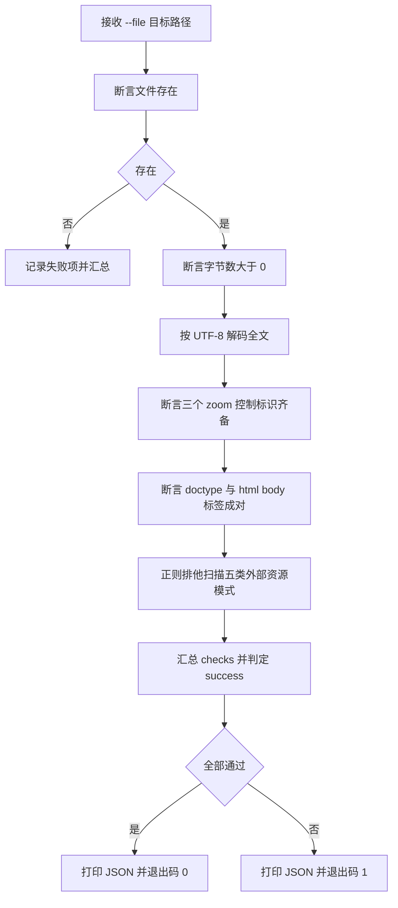

# Verify Interactive HTML (交互查看器 HTML 静态断言)

## Overview

Verify Interactive HTML 是 `format-zoomable-visual` 规约的物理探针。
它对生成的查看器 HTML 做纯静态断言，不启动浏览器、不引入第三方解析器（如 BeautifulSoup），仅用 Python 3 标准库的正则与字符串匹配得出结论。

断言覆盖四个维度：文件物理存在且非空、三个缩放控制标识齐备、HTML 结构标签成对、以及零外部资源引用。任一维度失败即退出码 1，并逐项输出明细，杜绝「看起来没问题」的口头验收。

## When to Use

- 生成的查看器 HTML 交付前，需要一道机器可复现的验收门禁时；
- 怀疑产物引用了 CDN、外链样式或外链脚本，需要排他扫描时；
- 人工改写过 HTML，需要确认三个缩放控制标识仍在位时；
- 作为 `interactive-image-viewer` 复合流程中「自检」环节的执行体时。

**触发禁区**：非 HTML 产物（Markdown、JSON、脚本源码）不适用本技能；需要验证渲染效果或交互行为时也不适用——本人只做静态断言，动态交互必须人工或浏览器自动化验证。

## Workflow



1. `[probe:file]` 断言 `--file` 指向的路径存在且是常规文件，不存在则直接以失败项收敛并退出 1；
2. `[probe:length]` 断言文件字节数严格大于 0，空文件阻断；
3. `[probe:regex]` 逐个匹配 `data-zoom-in`、`data-zoom-out`、`data-zoom-reset`，任一缺失即失败并点名缺失项；
4. `[probe:regex]` 匹配 `<!DOCTYPE html`、`<html`、`</html>`、`<body`、`</body>`，并对 `<html>` / `<body>` 做开闭计数配对断言；
5. `[probe:regex]` 排他扫描 `src="http`、`href="http`、`url(http`、`<script src=`、`<link `，命中任一即失败并回显命中片段与偏移上下文；
6. `[probe:exitcode]` 汇总 `checks` 数组，全部 `pass` 为真才返回 0，否则返回 1。

## Usage & Script

```bash
# 1. 先产出一个查看器（或用任意已存在的 html 替换）
python3 skills/build-image-viewer/scripts/build_viewer.py \
  --image /path/to/topology.png \
  --out /tmp/topology-viewer.html --title "管家拓扑图"

# 2. 机器模式：stdout 只有 JSON
python3 skills/verify-interactive-html/scripts/verify_html.py --file /tmp/topology-viewer.html --json

# 3. 人工模式：stdout 仍是 JSON，逐项明细打到 stderr
python3 skills/verify-interactive-html/scripts/verify_html.py --file /tmp/topology-viewer.html

# 4. 反向验证：断言缺少控制标识的 HTML 必须返回 1
python3 - <<'PY'
import pathlib
pathlib.Path("/tmp/broken.html").write_text(
    "<!DOCTYPE html>\n<html><body><p>no zoom controls</p></body></html>\n",
    encoding="utf-8",
)
PY
python3 skills/verify-interactive-html/scripts/verify_html.py --file /tmp/broken.html --json
echo "exit=$?"   # 期望 exit=1
```

成功时 stdout 形如：

```json
{"success": true, "file": "/tmp/topology-viewer.html", "checks": [{"name": "file_exists", "pass": true, "detail": "..."}]}
```

## Success Contract

| 退出码 | 触发条件 | stdout |
| :--- | :--- | :--- |
| 0 | 全部断言通过：文件存在且非空、三标识齐备、标签成对、零外部资源 | `{"success": true, "file": ..., "checks": [...]}`，且每个 `pass` 均为 `true` |
| 1 | 任一断言失败：文件缺失/为空、缺控制标识、标签不配对、命中外部资源模式、不可读 | `{"success": false, "file": ..., "checks": [...]}`，失败项 `pass` 为 `false` 且 `detail` 含原因 |

契约附加项：

- stdout 恒为单行合法 JSON，可直接管道给 `python3 -c` 或 `jq` 解析；
- `checks` 必须逐项列出四类断言，禁止只给一个总布尔值；
- `--json` 只抑制 stderr 的人类可读明细，不改变 stdout 结构，也不改变退出码。

## Boundaries & Constraints

- 只做静态断言，不启动浏览器、不做 DOM 解析、不验证渲染与交互行为；
- 只匹配契约列明的五类外部资源模式，**严禁泛化匹配任意 `http`**——`xmlns` 命名空间字符串不是外部资源，泛化扫描会造成误报；
- 不修改被校验文件，只读不写；
- 不负责修复失败项，修复应交回 `build-image-viewer` 或人工；
- 不得为「让门禁通过」而放宽断言；断言标准由 `format-zoomable-visual` 唯一确定。
