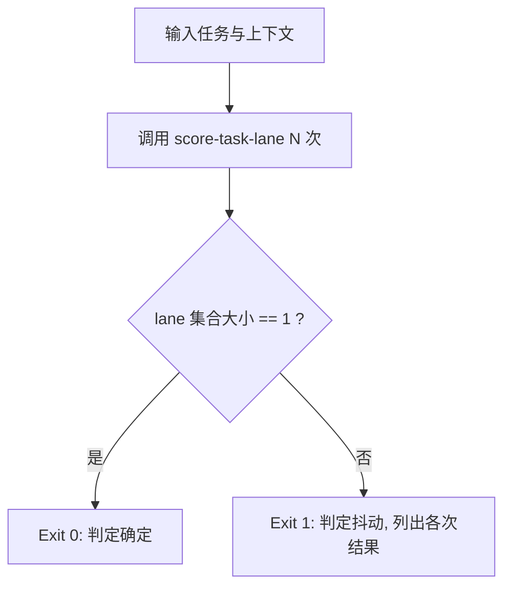

# Verify Lane Decision (分流判定复算探针)

## Overview

本技能是 L2 工序动作级探针：如果分流判定会随心情变化，那它就不是机制，只是感觉。
它把 `score-task-lane` 跑 N 次，验证同一输入永远得到同一条 lane。

## When to Use

- 修改了红线清单或分流阈值之后；
- 需要向用户证明「分流不是拍脑袋」时；
- 交付双流程能力前的确定性验收。

**触发禁区**：不用于判断分流结论是否合理（那是需求问题），只判断它是否稳定可复算。

## Workflow



1. `[probe:file]` 断言 `skills/score-task-lane/scripts/score_lane.py` 存在且非空；
2. `[probe:exitcode]` 连续调用该脚本 N 次（默认 10），每次使用完全相同的入参；
3. `[probe:regex]` 解析每次 stdout 的 `lane` 字段；
4. `[probe:exitcode]` 断言 lane 去重后只有一个取值，否则返回 1 并打印全部分歧。

## Usage & Script

```bash
python3 skills/verify-lane-decision/scripts/verify_lane.py --task "读取并解释需求文档" --repeat 10
python3 skills/verify-lane-decision/scripts/verify_lane.py --task "部署到生产环境" --repeat 10
```

## Success Contract

- Exit Code 0：N 次判定的 lane 完全一致，且 stdout 含 `consistent: true`、`lane`、`runs`；
- Exit Code 1：出现多种 lane，或 score 脚本不可用。

## Boundaries & Constraints

- 只读探针，不写入任何文件；
- 不修改被验证的判定逻辑，只如实报告抖动。
