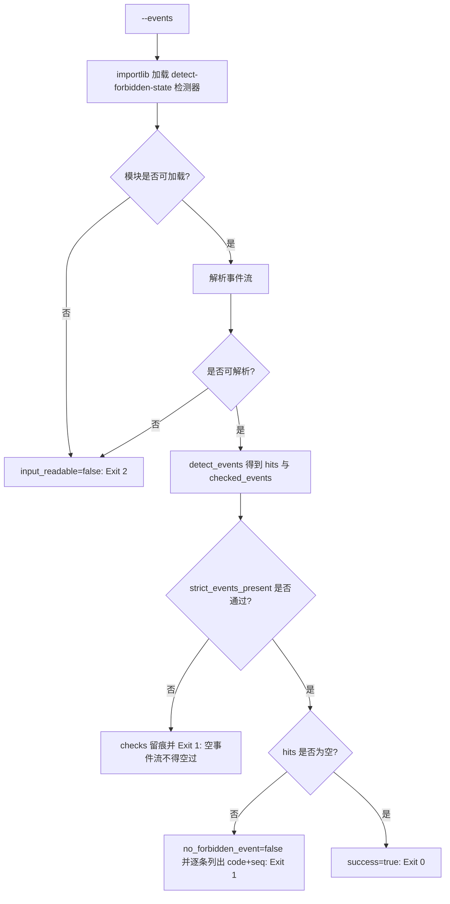

# Verify No Forbidden Event (反例零命中断言)

## Overview

本技能是 L2 工序动作级断言器，把 `detect-forbidden-state` 的检测结果收敛成一个布尔放行条件：
**`hits == 0`**。它通过 `importlib` 在**同一进程内**加载同仓库检测脚本（不起子进程、不做命令行拼接），
因此判据只有一套、不会因调用方式不同而漂移。

`--strict` 追加第二条断言：**`checked_events > 0`**——空事件流不得「空过」。
「没有事件」和「没有违例」是两件事：前者是证据缺失，后者才是合规结论。

## When to Use

- 交付验收需要断言「本次执行零反例命中」时；
- `anti-pattern-guard` 门禁放行前的最后一道断言；
- 需要把「无违例」这一主张变成可复算证据时。

**触发禁区**：本技能只断言，**不检测细节解释、不修复状态、不生成事件流**；事件流的生产与修复不由本技能负责。

## Workflow



1. `[probe:file]` 确认同仓库检测脚本 `skills/detect-forbidden-state/scripts/detect_forbidden.py` 存在；
2. `[probe:exitcode]` 用 `importlib.util.spec_from_file_location` 在进程内加载该模块（不起子进程），加载失败即退 2；
3. `[probe:file]` 校验 `--events` 指向的事件流文件存在且不是目录，不可读即退 2；
4. `[probe:regex]` 调用模块内 `read_events_path` 解析 JSONL，任一行非法 JSON 或非对象即退 2；
5. `[probe:length]` 调用模块内 `detect_events` 与默认阈值口径取得 `hits`，并取 `checked_events` 计数；
6. `[probe:exitcode]` 断言 `no_forbidden_event`：`hits` 必须为空数组，否则该断言记为 false 并退 1；
7. `[probe:length]` 在 `--strict` 下断言 `checked_events > 0`，事件为空即退 1；非 strict 下该断言恒真并在 `detail` 中标注模式；
8. `[probe:exitcode]` 输出 `checks` 数组并返回汇总退出码：全过退 0，任一不过退 1，输入不可读退 2。

## Usage & Script

```bash
# 常规断言：零命中即通过
python3 skills/verify-no-forbidden-event/scripts/verify_no_forbidden.py --events /tmp/events.jsonl --json

# 严格断言：空事件流不得「空过」
python3 skills/verify-no-forbidden-event/scripts/verify_no_forbidden.py --events /tmp/events.jsonl --strict --json
```

阈值口径由被加载的检测器统一给定（`DEFAULT_THRESHOLDS`），本技能**不提供阈值参数**：断言层不参与判据调参，否则「零命中」将失去可比性。

## Success Contract

- Exit Code 0：`checks` 全部为 `pass == true`，即 `hits` 为空且（`--strict` 时）`checked_events > 0`；
- Exit Code 1：`hits` 非空（输出逐条 `code` 与 `seq`），或 `--strict` 下 `checked_events == 0`；
- Exit Code 2：输入不可读或不可解析（检测模块加载失败、`--events` 缺失、文件不存在或为目录、JSONL 行非法）；
- stdout 恒为合法 JSON，含 `success` / `checked_events` / `hits` / `checks` 四个字段；退 2 时额外带 `error`。

## Boundaries & Constraints

- **不做子进程**：检测必须经 `importlib` 进程内加载，禁止 `subprocess` 调用检测脚本，避免出现第二套调用口径；
- **不调参**：断言层不暴露阈值参数，判据阈值只有一个来源（检测器的 `DEFAULT_THRESHOLDS`）；
- **不修复、不记录后继续**：断言失败即阻断，禁止把命中结果只写进日志后继续执行；
- **空过即失败**：`--strict` 的语义是「没有证据不等于没有违例」，空事件流一律判不通过；
- 本技能不写任何文件，输出即全部产物。
