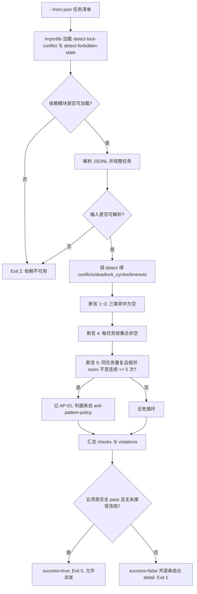

# Verify No Lock Violation (并行派单前放行断言器)

## Overview

本技能是并行派发的**最后一道断言**：把 `detect-lock-conflict` 的检测结果加上「锁是否声明」与「是否死循环」
两项体检，收敛成一份 `checks` 清单，**五项全过才允许并行派发**。

五项硬断言：

| 序 | 断言名 | 判据 | 违约记录 |
| :--- | :--- | :--- | :--- |
| 1 | `no_lock_conflict` | 无 `lock_conflict`（两任务锁集合交集非空） | `violations[].kind = lock_conflict` |
| 2 | `no_deadlock_cycle` | 无 `deadlock_cycle`（等待图成环） | `violations[].kind = deadlock_cycle` |
| 3 | `no_lock_timeout` | 无 `lock_timeout`（跨度超 `timeout_s` 或逻辑已超时） | `violations[].kind = lock_timeout` |
| 4 | `locks_declared` | 每个任务锁集合非空 | `violations[].kind = missing_locks` |
| 5 | `no_loop_ap01` | 无 AP-01 死循环 | `violations[].kind = AP-01` |

**第 5 项复用 AP-01，不另立判据**：判据来自 `anti-pattern-policy` 的 **AP-01（连续相同 `action` 且 `state` 不变 ≥ 5 次）**，
在本技能中的落地形态是——**同一任务在 JSONL 中重复出现且相邻记录的 `locks` 完全相同时，连续 ≥ 5 次即记 AP-01**。
实现上把「任务名」映射为 `action`、把「归一化去重排序后的锁集合」映射为 `state`，
再用 importlib 加载 `detect-forbidden-state` 的检测器做同一判定，因此**阈值与判据编号完全来自唯一真相源**，本地不复制第二份。

**为什么第四项必须存在**：没有声明锁的任务在机器眼里与「持有零个键」无法区分，
一个声明不出任何共享资源键却要写的任务，就是**无锁共享写**——放行它等于让并行方案失去全部约束。

## When to Use

- 并行派发之前，需要一条「可以开跑」的机器判据（而不是主观估计）时；
- 交付验收需要给出「五项断言逐条 `pass == true`」的可复算证据时；
- 某批任务出现重复执行迹象，需要确认是否已构成死循环时。

**触发禁区**：单任务串行执行、无并行调度语义的任务集不经过本断言；本断言**不放行也不阻塞真实进程**，只输出裁决。

## Input Contract

JSONL，每行一个并行任务（同 `detect-lock-conflict`）：

```json
{"task":"pkg-006-t1","locks":["skills/a/SKILL.md"],"depends_on":["pkg-006-t0"],"timeout_s":300,"started_at":1000,"finished_at":1060}
```

重复行语义：**同一 `task` 出现多行表示该任务被多次执行**；相邻记录的 `locks` 完全相同且连续 ≥ 5 次即触发 AP-01 分支。

## Workflow



1. `[probe:file]` 校验 `--from-json` 指向的文件存在且不是目录；脚本自身与两个依赖脚本（`detect-lock-conflict`、`detect-forbidden-state`）都必须存在，否则输出 `error` 并退 2；
2. `[probe:regex]` 以 importlib 进程内加载两个依赖模块并断言导出符号可用（`normalize_key` / `build_tasks` / `detect` / `detect_events` / `DEFAULT_THRESHOLDS`），缺失即退 2；
3. `[probe:regex]` 逐行解析 JSONL：空行跳过，任一行非法 JSON 或非对象即退 2；`task` 缺失或 `locks` 非数组即退 2；
4. `[probe:length]` 断言 1：`conflicts` 为空；非空即逐条记 `lock_conflict` 违规（`--allow-conflict` 时降级为已接受，不单独阻断）；
5. `[probe:length]` 断言 2：`deadlock_cycles` 为空；非空即逐条记 `deadlock_cycle` 违规并保留环路径；
6. `[probe:length]` 断言 3：`timeouts` 为空；非空即逐条记 `lock_timeout` 违规并保留跨度和上限；
7. `[probe:length]` 断言 4：逐任务断言归一化去重后的锁集合非空，为空即记 `missing_locks`（无锁共享写，明确禁止项）；
8. `[probe:length]` 断言 5：按任务名分组，把「任务名 → `action`、锁集合 → `state`」改写成事件流，交 `detect-forbidden-state` 的 `detect_events` 判定，命中 AP-01 即记违规，`detail` 必须写明判据来自 `anti-pattern-policy` AP-01；
9. `[probe:regex]` 断言 `violations` 中不残留 `accepted` 为真以外的阻断项：`--allow-conflict` 只豁免 `lock_conflict`，其余四类一律照旧阻断；
10. `[probe:exitcode]` 汇总 `checks`（五项 `name`/`pass`/`detail`）与 `violations`：五项全过退 0，存在未接受违规退 1，输入或依赖不可用退 2。

## Usage & Script

```bash
# 合规样例：五项全过 → Exit 0
python3 skills/verify-no-lock-violation/scripts/verify_no_lock_violation.py --from-json tasks.jsonl --json

# 冲突样例：断言 1 失败 → Exit 1
python3 skills/verify-no-lock-violation/scripts/verify_no_lock_violation.py --from-json conflict.jsonl --json

# 显式接受已知冲突（只豁免 lock_conflict，其余四项照旧）
python3 skills/verify-no-lock-violation/scripts/verify_no_lock_violation.py --from-json conflict.jsonl --allow-conflict --json

# 输入不可读 → Exit 2
python3 skills/verify-no-lock-violation/scripts/verify_no_lock_violation.py --from-json /tmp/not-exist.jsonl --json
```

## Output Contract (输出字段)

```json
{"success":false,
 "checks":[{"name":"no_loop_ap01","pass":false,"detail":"命中 AP-01：pkg-006-t1"}],
 "violations":[{"kind":"AP-01","task":"pkg-006-t1","seq":[1,2,3,4,5],"detail":"判据来自 anti-pattern-policy AP-01（…）"}]}
```

| 字段 | 含义 |
| :--- | :--- |
| `checks[].name` | 五项断言名闭集：`no_lock_conflict` / `no_deadlock_cycle` / `no_lock_timeout` / `locks_declared` / `no_loop_ap01` |
| `checks[].pass` | 该断言是否通过 |
| `checks[].detail` | 通过/失败的人类可读证据 |
| `violations[].kind` | `lock_conflict` / `deadlock_cycle` / `lock_timeout` / `missing_locks` / `AP-01`（输入错误时另有 `input_unreadable`） |
| `violations[].accepted` | 仅 `lock_conflict` 且 `--allow-conflict` 时为 `true` |
| `error` | 仅输入或依赖不可读时出现 |

## Success Contract

| 退出码 | 含义 |
| :--- | :--- |
| 0 | 五项断言全过（或 `--allow-conflict` 下仅剩已显式接受的 `lock_conflict`），允许并行派发 |
| 1 | 存在未接受的违规：锁冲突 / 死锁环 / 超时未释放 / 未声明锁 / AP-01 |
| 2 | 输入不可读或依赖脚本不可用（缺 `--from-json`、文件不存在/是目录/不可读、JSONL 行非法、`task` 缺失、`locks` 非数组、依赖模块加载失败） |

## Boundaries & Constraints

- **只断言不修复**：本技能不改写任务、不释放锁、不重排调度，只输出裁决；
- **判据不复制**：AP-01 的阈值与编号来自 `anti-pattern-policy`，通过 `detect-forbidden-state` 的检测器执行，**禁止本地另立第二套死循环判据**；
- **`--allow-conflict` 有边界**：只豁免 `lock_conflict` 一类，死锁环、超时、未声明锁、AP-01 一律照旧阻断；
- **时间只从输入字段读**：不取系统当前时间，同输入恒得同结论；
- **不改动任何文件**：本技能只读输入、只写 stdout；importlib 加载依赖时关闭字节码落盘，不在他人技能目录留副产物。
