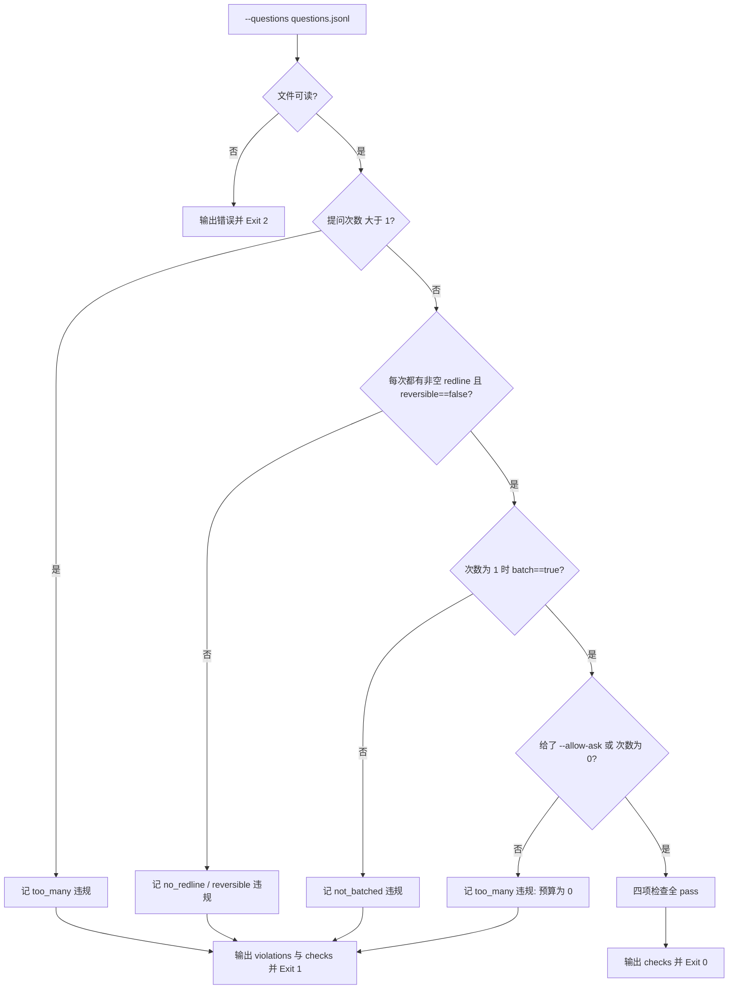

# Verify No Unnecessary Question (反问检测断言器)

## Overview

Verify No Unnecessary Question 是 `one-shot-resolution-policy` 第 ④ 条「提问例外 = 红线 + 不可逆 + 每任务 ≤ 1 次且批量合并」的物理执行层，
是 `record-assumptions` 的下游：留痕做完了，最后一步是回头看**本次任务到底问了几次、每次问得合不合法**。

它只做一件事——把问题记录逐条断言，四条全过才 Exit 0。**默认零提问**：
没有 `--allow-ask` 时，任何一次提问都直接判失败。

## When to Use

- 一次任务收尾、准备交付回复，需要证明「本次没有不必要的追问」时；
- 复核某次提问是否满足「红线 + 不可逆 + 批量」三条件时；
- 作为 `one-shot-guard` 门禁的最后一环时。

**触发禁区**：本技能只读问题记录、不做提问也不改写记录；没有问题记录时按零提问放行。

## Workflow



1. [probe:file] 断言 `--questions` 指向真实存在且可读的 JSONL 文件，每行一条 `{"seq","item","redline","reversible","batch","merged_count"}`；
2. [probe:length] 断言提问次数 ≤ 1（每任务），超出的每一次都记 `kind=too_many` 并点名 `seq`；
3. [probe:regex] 断言每次提问都同时满足「`redline` 非空」与「`reversible == false`」，不满足分别记 `no_redline` / `reversible`；
4. [probe:exitcode] 断言次数为 1 时必须 `batch == true`，否则记 `not_batched`（挤牙膏式追问）；
5. [probe:exitcode] 断言未提供 `--allow-ask` 时提问次数必须为 0，否则记违规并整体 Exit 1。

## Usage & Script

```bash
# 零提问（默认放行）
: > /tmp/questions.jsonl
python3 skills/verify-no-unnecessary-question/scripts/verify_no_question.py \
  --questions /tmp/questions.jsonl --json

# 一次合法提问：带 R1 且 irreversible 且 batch=true
printf '{"seq":1,"item":"删除旧的日志目录","redline":"R1","reversible":false,"batch":true,"merged_count":2}\n' > /tmp/questions.jsonl
python3 skills/verify-no-unnecessary-question/scripts/verify_no_question.py \
  --questions /tmp/questions.jsonl --json              # 默认零提问 -> Exit 1
python3 skills/verify-no-unnecessary-question/scripts/verify_no_question.py \
  --questions /tmp/questions.jsonl --allow-ask --json  # 授权后 -> Exit 0

# 两次提问 -> too_many
printf '{"seq":1,"redline":"R1","reversible":false,"batch":true}\n{"seq":2,"redline":"R2","reversible":false,"batch":true}\n' > /tmp/two.jsonl
python3 skills/verify-no-unnecessary-question/scripts/verify_no_question.py \
  --questions /tmp/two.jsonl --allow-ask --json

# 一次无红线提问 -> no_redline
printf '{"seq":1,"item":"阈值取值","redline":null,"reversible":true,"batch":false}\n' > /tmp/nored.jsonl
python3 skills/verify-no-unnecessary-question/scripts/verify_no_question.py \
  --questions /tmp/nored.jsonl --allow-ask --json

# 非 JSON 紧凑输出（PASS/FAIL + 逐项检查）
python3 skills/verify-no-unnecessary-question/scripts/verify_no_question.py --questions /tmp/questions.jsonl --allow-ask
```

红线编号取值必须来自 `fastlane-redline-policy` 的 R1~R5；本脚本只断言 `redline` 非空，不校验编号本身。

## Success Contract

- Exit Code 0：四项断言全过，`success == true`，`violations` 为空；
- Exit Code 1：存在任一违规（`too_many` / `no_redline` / `reversible` / `not_batched`），逐条给出 `seq` 与 `detail`；
- Exit Code 2：`--questions` 指向的文件不存在或不可读（含空文件以外的解码失败）。

## Boundaries & Constraints

- **默认零提问**：`--allow-ask` 是显式授权开关，不给就等于本次任务提问预算为 0；
- **上限是硬上限**：每任务 1 次不可按任务规模放宽，出现第二次提问即 `too_many` 判失败；
- **kind 枚举固定**：只允许 `too_many` / `no_redline` / `reversible` / `not_batched` 四值；
  「未授权提问」在语义上就是预算被击穿，归入 `too_many` 并在 `detail` 写明真因，不新增枚举值；
- **redline 只判非空**：红线清单唯一真相源是 `fastlane-redline-policy`，本脚本不复制清单、不校验编号合法性；
- **确定性**：断言只依赖输入字段与固定优先级，禁止随机数、时间戳与外部网络。
