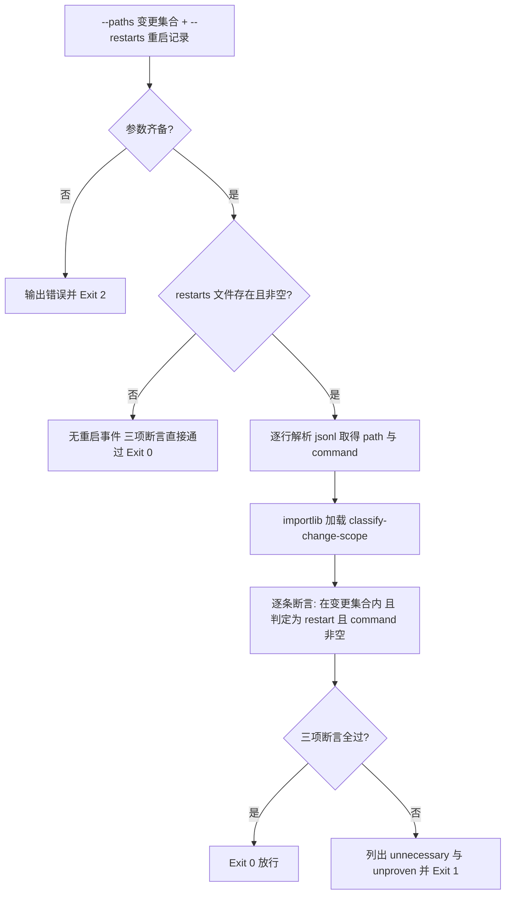

# Verify No Unnecessary Restart (重启证据断言门禁)

## Overview

Verify No Unnecessary Restart 是「零重启」链路的断言层：
它接收**当前变更路径集合**与**实际发生的重启事件**（jsonl），逐条复核每个重启是否有证据。

三项断言（全部通过才放行）：

| 序 | 断言 | 不通过的记录 |
| :--- | :--- | :--- |
| 1 | 每个重启事件的 `path` 在当前变更路径集合内 | 不必要重启 |
| 2 | 每个重启事件的 `path` 经 `classify-change-scope` 判定为 `restart`（确实需要重启） | 不必要重启 |
| 3 | 每个重启事件带非空 `command`（重建命令） | 无证据重启 |

判定口径由同仓库 `skills/classify-change-scope/scripts/classify_scope.py` 提供，**用 importlib 直接加载**（不起子进程），
加载失败才退化为子进程调用；两者都不可用时退 2，绝不给出「假通过」。
**`--restarts` 文件不存在或为空视为通过**（本次没有重启，正是默认目标）。

## When to Use

- 一次改动收尾时，复核过程中记录的重启事件是否都必要、是否都带重建命令；
- 写入门禁 `zero-restart-guard` 需要一条可物理断言的放行条件时；
- 复盘「为什么这次重启了」，需要把不必要/无证据重启逐条列出时。

**触发禁区**：没有变更路径集合时不适用；本技能只断言重启的必要性与证据，不代为执行重建命令，也不判定宿主侧不可热更边界本身是否合理。

## Workflow



1. `[probe:exitcode]` 断言参数齐备：`--paths` 过滤后非空、`--restarts` 已提供，任一缺失即输出错误并退 2；
2. `[probe:file]` 读取 `--restarts`：文件不存在或为空按契约视为通过并退 0；存在则逐行解析 jsonl，任一行不可解析或缺非空 `path` 即退 2；
3. `[probe:exitcode]` 用 importlib 加载 `classify-change-scope` 的 `classify_paths()` 与 `normalize_path()`，加载失败退化为子进程调用，两者皆不可用则退 2；
4. `[probe:length]` 逐条断言三项：路径在变更集合内、路径判定为 `restart`、`command` 去空白后非空；不满足者分别落入 `unnecessary` 与 `unproven`；
5. `[probe:exitcode]` 汇总 `checks` 三项 `pass`：全过退 0 放行，任一为假退 1 阻断。

## Usage & Script

```bash
# 正向：只改 skills/**，且没有重启记录 → Exit 0
python3 skills/verify-no-unnecessary-restart/scripts/verify_no_restart.py \
  --paths skills/dsh-butler/SKILL.md --restarts /tmp/restarts-empty.jsonl --json

# 反向 A：改 skills/** 却记录了重启 → Exit 1，unnecessary 非空
printf '{"path":"skills/dsh-butler/SKILL.md","command":"pnpm run build","reason":"误判"}\n' > /tmp/restarts-bad.jsonl
python3 skills/verify-no-unnecessary-restart/scripts/verify_no_restart.py \
  --paths skills/dsh-butler/SKILL.md --restarts /tmp/restarts-bad.jsonl --json

# 反向 B：改宿主 bundle 记录重启但缺重建命令 → Exit 1，unproven 非空
printf '{"path":"/Applications/DSH Desktop.app/Contents/Resources/app/package.json","command":"","reason":"缺命令"}\n' \
  > /tmp/restarts-unproven.jsonl
python3 skills/verify-no-unnecessary-restart/scripts/verify_no_restart.py \
  --paths "/Applications/DSH Desktop.app/Contents/Resources/app/package.json" \
  --restarts /tmp/restarts-unproven.jsonl --json

# 通过样例：宿主 bundle 重启且带重建命令 → Exit 0
printf '{"path":"/Applications/DSH Desktop.app/Contents/Resources/app/package.json","command":"pnpm run rebuild:app","reason":"宿主 bundle 不可热更"}\n' \
  > /tmp/restarts-ok.jsonl
python3 skills/verify-no-unnecessary-restart/scripts/verify_no_restart.py \
  --paths "/Applications/DSH Desktop.app/Contents/Resources/app/package.json" \
  --restarts /tmp/restarts-ok.jsonl --json

# 缺参 → Exit 2
python3 skills/verify-no-unnecessary-restart/scripts/verify_no_restart.py --paths skills/dsh-butler/SKILL.md
```

## Success Contract

- Exit Code 0：三项断言全部通过（`--restarts` 文件不存在或为空同样通过）；
- Exit Code 1：存在不必要重启（`unnecessary` 非空）或无证据重启（`unproven` 非空）；
- Exit Code 2：参数缺失、restart 记录不可解析，或判定器不可用。

JSON 契约：`{"success":bool,"restart_events":n,"unnecessary":[{"path","reason"}],"unproven":[{"path"}],"checks":[{"name","pass","detail"}]}`，
`success` 等价于 `checks` 三项全 `pass`。

## Boundaries & Constraints

- **默认零重启**：没有重启记录即通过，本技能不为「重启」背书，只为「有证据的重启」放行；
- **确定性**：断言只依赖输入路径、restart 记录与固定判定表，禁止随机数、时间戳、网络与模型主观判断；
- **判定器唯一**：分类口径必须来自 `classify-change-scope`，禁止在本脚本内复制第二份判定表；
- **不执行命令**：`command` 字段只被断言非空，本技能绝不代为执行重建命令；
- **只读**：除 stdout 外不写任何文件、不修改仓库任何路径。
