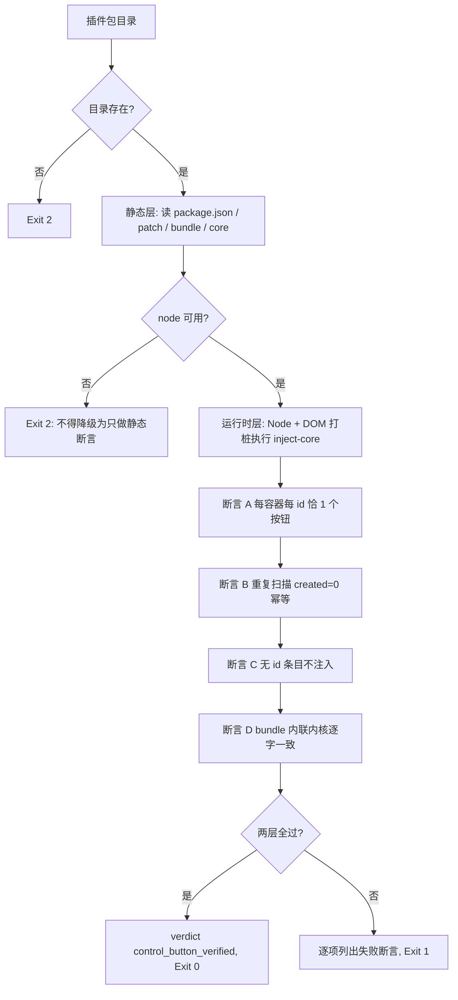

# Verify Plugin Control Button (插件常显调控按钮断言器)

## Overview

本技能对「每个插件市场下载的插件都有常显调控按钮」这件事给出**可证伪的证据**，
而且是**两层**：静态契约层与**运行时**层。

**为什么必须有运行时层**：只做静态断言（文件里有没有某个字符串）证明不了
「重复渲染之后按钮不会翻倍」。那类缺陷只在真的跑一遍注入逻辑时才暴露。
因此本技能用 Node + DOM 打桩**真实执行** `inject-core.cjs`。

## When to Use

- 交付插件常显调控按钮之前，需要给出可复算证据时；
- 修改了注入内核或 bundle 之后需要回归时。

**触发禁区**：只断言，不安装插件、不修改内核、不改 profile；缺 Node 时**退 2**，
绝不降级为「只跑静态断言也算过」。

## Workflow



1. `[probe:file]` 断言插件包目录存在，缺失即退 2；
2. `[probe:file]` 断言 `package.json` 存在且可解析，不可解析即退 2；
3. `[probe:regex]` 断言 `name` 与目录名一致、`dsh.client.platform == "web"`、`dsh.client.inject` 是数组、`exports["./client"]` 存在；
4. `[probe:regex]` 断言 `cordis.patch.yml` 存在且包含本插件 id（否则装进去也不会被启用）；
5. `[probe:regex]` 断言 `lib/client.js` 经 `__ModuleLoader__.load` 注册且 id 逐字正确、含 `async apply(ctx)`、零外部资源引用；
6. `[probe:length]` 断言 bundle **逐字包含** `src/inject-core.cjs` 的完整内容（内联不得漂移，否则会有两份实现）；
7. `[probe:file]` 定位 Node 运行时（`$DSH_HOME/.desktop-bin/node` 或 PATH），找不到即退 2；
8. `[probe:exitcode]` 跑 `harness.cjs`：用 http:// 打桩文档对象真实执行 `applyButtons`，断言每（容器, 插件 id）恰 1 个按钮；
9. `[probe:length]` 断言幂等：同一批条目二次扫描 `created == 0`、`skippedExisting` 等于已有按钮数；
10. `[probe:exitcode]` 断言无插件 id 的条目 `created == 0`（宁可不显示，也不显示点了没用的按钮），任一层失败即退 1。

## Usage & Script

```bash
python3 skills/verify-plugin-control-button/scripts/verify_plugin_button.py --all --json
```

实测：静态 13 项 + 运行时 18 项 = **31 项全过**，`verdict = control_button_verified`。

运行时层覆盖的关键断言：

| 断言 | 内容 |
| --- | --- |
| A1–A5 | 首次注入 2 个按钮、重复 id 计 duplicates、无 id 跳过、属性与 id 逐字一致 |
| B1–B3 | 二次扫描 `created=0`（幂等），按钮总数不增 |
| C1–C2 | 跨容器互不干扰（同一插件在两个容器各一个按钮） |
| D1 | 无 id 条目 `created=0` |
| E1 | 同容器同名必然去重 |
| F1–F2 | `resolvePluginId` 三级回退与空串返回 |
| G1–G4 | bundle 注册 id、内联内核、apply/inject、零外链 |

## Success Contract

| 退出码 | 含义 |
| --- | --- |
| 0 | 静态层与运行时层全过 |
| 1 | 任一断言失败，逐项列出 |
| 2 | 输入不可读（包目录缺失、内核不可读、Node 不可用） |

## Boundaries & Constraints

- **两层缺一不可**：只做静态断言证明不了幂等，只做运行时断言证明不了宿主契约；
- **缺 Node 即退 2**：不降级、不放行，「只跑一半」不算验证；
- **只读**：不安装、不改 profile、不改内核；
- **可证伪**：每个断言都有对应的失败构造（重复 id、无 id 条目、二次扫描），不是恒真检查。
