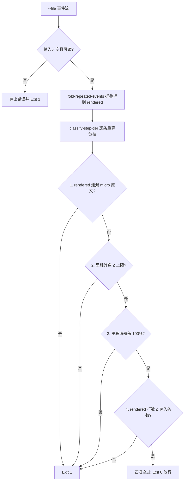

# Verify Progress Budget (过程输出预算断言门禁)

## Overview

Verify Progress Budget 是过程输出里程碑化的**放行闸门**：
折叠本身做得好不好，不由折叠器自证，而由本门禁对折叠产物逐项断言。
四项断言全过才 Exit 0；任何一项失败即 Exit 1，禁止把违规过程输出交给用户。

## When to Use

- `fold-repeated-events` 产出折叠结果后的强制验收步骤；
- 交付前检查过程回报是否仍然刷屏（微操作泄漏）或失真（里程碑被吞）；
- 审计历史过程日志的折叠质量时。

**触发禁区**：纯只读问答与单步回答不跑本门禁；本门禁只判过程输出形态与无损性，不评价任务结论对错。

## Workflow



1. `[probe:file]` 断言 `--file` 指向真实存在的可读事件文件且至少一条事件，否则 Exit 1；
2. `[probe:exitcode]` 调用 `fold-repeated-events` 取得 `rendered`（可用 `--rendered` 改判外部折叠产物），折叠不可用即 Exit 1；
3. `[probe:regex]` 断言项 1：逐条比对输入中判定为 micro 的事件文本，`rendered` 中出现次数必须为 0；
4. `[probe:length]` 断言项 2：折叠后保留的里程碑条数 ≤ `--max-milestones`（默认 8）；
5. `[probe:length]` 断言项 3：输入中所有 milestone 事件都出现在 `rendered` 中，覆盖率必须为 100%；
6. `[probe:length]` 断言项 4：`rendered` 行数 ≤ 输入事件数，禁止折叠后反而变长；
7. `[probe:exitcode]` 四项全过 Exit 0；任一失败必须输出失败断言名与明细并 Exit 1，禁止静默放行。

## Usage & Script

```bash
# 正常样例：12 条事件（3 milestone + 5 micro + 4 action）应 Exit 0
python3 skills/verify-progress-budget/scripts/verify_progress.py --file /tmp/events.jsonl --json

# 收紧预算：里程碑上限 2，超出即 Exit 1
python3 skills/verify-progress-budget/scripts/verify_progress.py --file /tmp/events.jsonl --max-milestones 2

# 对抗式校验：断言一份手工给出的、被删掉里程碑的折叠产物应 Exit 1
python3 skills/verify-progress-budget/scripts/verify_progress.py \
  --file /tmp/events.jsonl --rendered /tmp/rendered_lossy.txt
```

## Success Contract

- Exit Code 0：四项断言全部通过（零 micro 泄漏 + 里程碑在预算内 + 覆盖率 100% + 事件数不增加）；
- Exit Code 1：任一断言失败，或输入为空 / 文件不存在不可读 / 折叠器不可用。

输出 JSON 固定为 `{"success","checks":[{"name","pass","detail"}],"before_events","after_events","milestones"}`，
其中 `milestones` 为折叠后实际保留的里程碑条数。

## Boundaries & Constraints

- **只判定不改写**：本门禁不修复 `rendered`，失败必须回到折叠层重跑，禁止就地删改事件；
- **两条红线**：里程碑只增不删（断言 3）、微操作只折叠不静默丢弃（断言 1 的计数必须与输入 micro 条数一致）；
- **判定确定性**：分档复用 `classify-step-tier`，禁止在本脚本内另写判定词表；
- 不引入第三方依赖，不使用随机数与时间戳，同一输入必须产出同一判定结论。
