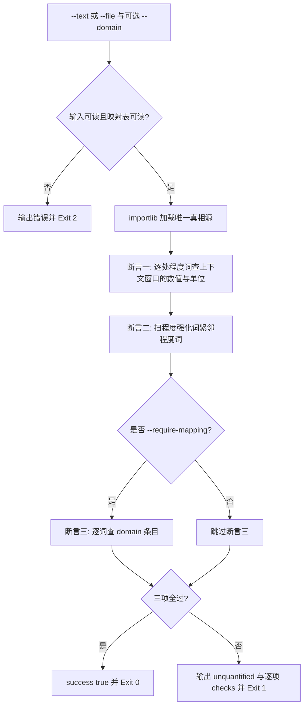

# Verify Quantified Output (量化输出三项硬断言)

## Overview

本技能是「修饰程度词必须量化」（`REQ-BUTLER-QUANTIFY-023`）流水线的**放行闸门**：
替换器不自证合规，合格与否由本门禁对正文逐项断言。

三项断言（**全部通过才 Exit 0**）：

| 序号 | 断言名 | 判据 | 失败含义 |
| :--- | :--- | :--- | :--- |
| 1 | `no_unquantified_degree` | 每一处程度词命中的上下文窗口（前 24 字 / 后 40 字）内必须出现「数值 + 单位」 | 程度词没有数值兜底，无法验收 |
| 2 | `no_degree_word_replacement` | 程度强化词紧邻程度词即违规（很快 / 非常快 / 极其严重） | 用另一个程度词替换程度词，可判定性没变 |
| 3 | `mapping_required`（仅 `--require-mapping`） | 每个命中词都能在映射表里找到 domain 条目 | 场景量化映射缺失，需先建表或声明假设 |

三项断言各有独立语义，互不替代：

- 断言 1 问「**文本里落数了没有**」——只看正文里的数值与单位，不看映射表有没有条目；
- 断言 2 问「**有没有拿程度词糊过去**」——拦住「很快 → 非常快」这类改法；
- 断言 3 问「**映射侧够不够**」——要求命中词在指定场景（或任一场景）下都有条目，
  这与断言 1 互补：文本可以带数值而映射表空缺，也可以有映射而文本没落数。

词表与映射表读写都来自唯一真相源 `detect-vague-modifier`（importlib 进程内加载，不起子进程），
本门禁**不另写一套词表**。

## When to Use

- 交付前最后一道量化门禁：面向用户的结论、报告、技能契约交付前必须过；
- 收到「量纲对不上」「照样看不懂」反馈时，定位到具体未量化词与行号；
- 复核一次改写是否只是把「快」换成「很快」（反向验证）。

**触发禁区**：纯代码块、纯 JSON 载荷与纯数值报表不经过本门禁——它们本就没有待量化的修饰词；本门禁也不评价数值取得对不对，只判「有没有量」。

## Workflow



1. `[probe:file]` 断言 `--text` 与 `--file` 至少给出一个且文件可读，并断言 `quantifier-table.json` 可读，任一不成立 Exit 2；
2. `[probe:exitcode]` 以 importlib 进程内加载 `skills/detect-vague-modifier/scripts/detect_vague.py` 取词表、扫描函数与量化表达式正则；
3. `[probe:regex]` 断言一：对每处程度词命中，取前 24 字与后 40 字窗口匹配「数值 + 单位」，无匹配即计入 `unquantified`；
4. `[probe:regex]` 断言二：用「程度强化词 + 程度词」紧邻正则扫全文，命中即记录词、行号与片段；
5. `[probe:file]` 断言三（仅在 `--require-mapping` 时）：逐词查 `(term, domain)` 条目，未命中即计入缺失清单；
6. `[probe:exitcode]` 三项全过 Exit 0；任一不通过输出 `unquantified` 与逐项 `checks` 后 Exit 1。

## Usage & Script

```bash
# 已量化样本：Exit 0，三项断言全 PASS
python3 skills/verify-quantified-output/scripts/verify_quantified.py \
  --text '在代码库场景，大文件指单个文件 ≥1 MB。' --domain 代码库 --require-mapping --json

# 未量化样本：Exit 1，列出词与行号
python3 skills/verify-quantified-output/scripts/verify_quantified.py \
  --text '子智能体上报大量同质动作（连续读文件、连续点击）需要汇总时；' --json

# 反向验证：程度词被另一个程度词替换，断言二必须失败
python3 skills/verify-quantified-output/scripts/verify_quantified.py \
  --text '接口响应很快' --domain 接口响应 --json

# 真实文档整篇判定
python3 skills/verify-quantified-output/scripts/verify_quantified.py \
  --file skills/fold-repeated-events/SKILL.md --json
```

## Success Contract

JSON 载荷固定为三字段：

| 字段 | 类型 | 含义 |
| :--- | :--- | :--- |
| `success` | 布尔 | 全部断言是否通过 |
| `unquantified` | 数组 | `[{"term","line","snippet"}]`，断言一命中的未量化程度词 |
| `checks` | 数组 | `[{"name","pass","detail"}]`，逐项断言的判定与证据（`detail` 含词与行号） |

退出码：

| 码 | 含义 |
| :--- | :--- |
| 0 | 三项断言全部通过 |
| 1 | 存在未量化程度词、程度词替换程度词，或缺失 domain 映射 |
| 2 | 输入缺失（既无 `--text` 也无 `--file`、文件不可读），或量化映射表不可读 |

## Boundaries & Constraints

- **判定权唯一**：词表与映射表口径只在 `detect-vague-modifier` 与 `quantifier-table.json` 定义，本门禁不另写一套；
- **不放宽断言 1**：合规样本被误判时先查该词是否真的在正文里带了数值与单位，禁止下调窗口或豁免词；
- **断言 2 不做例外**：程度词叠用没有宽容参数，「很快」「非常快」「极其严重」一律违规；
- **不代写正文**：门禁只判定与定位，改写必须显式执行并重跑；
- **零子进程、零第三方依赖**：唯一真相源以 importlib 进程内加载，无随机数与时间戳，同一输入同一结论。
