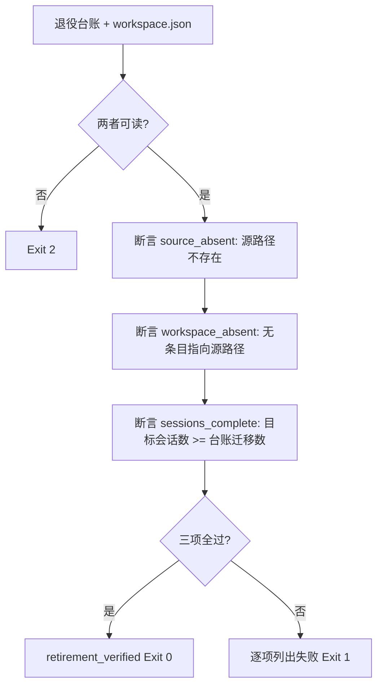

# Verify Workspace Retirement (工作区退役断言器)

## Overview

本技能回答一个只能用实数回答的问题：**「源目录真的消失了吗？注册项真的摘掉了吗？会话真的没丢吗？」**

「我删了」不是证据，「`os.path.isdir` 为假」才是。

## When to Use

- 退役执行完成后需要给出可复核证据时；
- 需要证明「注册项没有指向不存在的路径」时。

**触发禁区**：只断言，不删目录、不改 workspace.json、不写文件。

## Workflow



1. `[probe:file]` 断言退役台账存在且可解析，缺失即退 2；
2. `[probe:file]` 断言 `workspace.json` 存在且可解析，缺失即退 2；
3. `[probe:file]` 断言 `source_absent`：`os.path.exists(源路径)` 为假——这是退役的**物理证据**；
4. `[probe:regex]` 断言 `workspace_absent`：遍历全部工作区条目，无一条的 `path` 等于源路径；
5. `[probe:length]` 断言 `sessions_complete`：目标工作区的 `sessionIds` 条数 ≥ 台账记录的迁移数，且目标工作区存在；
6. `[probe:length]` 三项分别输出实测值（不是布尔的「已通过」），便于人工复核；
7. `[probe:exitcode]` 三项全过退 0 输出 `retirement_verified`，任一失败退 1 并逐项列出；
8. `[probe:file]` 断言台账里含 `rollback` 字段，缺失即判「退役不可回滚」；
9. `[probe:regex]` 断言台账里的 `source` / `target` 都是绝对路径，相对路径无从复核；
10. `[probe:exitcode]` 本技能不写任何文件，重复运行结果逐字节相同。

## Usage & Script

```bash
python3 skills/verify-workspace-retirement/scripts/verify_retirement.py --all --json
```

## Success Contract

| 退出码 | 含义 |
| :--- | :--- |
| 0 | 三项全过（`retirement_verified`） |
| 1 | 任一失败（源仍在 / 条目仍在 / 会话不完整） |
| 2 | 台账或 workspace.json 不可读 |

## Boundaries & Constraints

- **只断言**：不删目录、不改 workspace.json、不写文件；
- **输出实测值**：禁止只给布尔结论；
- **台账必须可回滚**：缺 `rollback` 字段即判不合格；
- **确定性**：同输入逐字节同输出。
