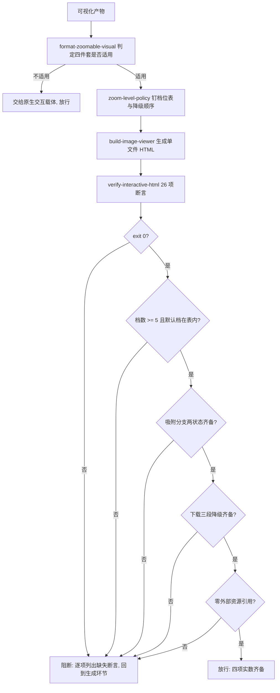

# Visual Interaction Guard (可视化交互四件套放行门禁)

## Overview

本技能把可视化交互的四件套（点击放大 / 多级缩放 / 复位 / 下载）串成**一道放行门禁**：

| 序 | 环节 | 承载技能 | 物理产物 | 不通过时 |
| :---: | :--- | :--- | :--- | :--- |
| 1 | 规约 | `format-zoomable-visual` | 四件套判据 | 缺件即阻断 |
| 2 | 口径 | `zoom-level-policy` | 13 档档位表 + 三段降级顺序 | 连续乘法冒充多级即阻断 |
| 3 | 生成 | `build-image-viewer` | 单文件 HTML（内联档位表与下载名） | 生成失败即阻断 |
| 4 | 断言 | `verify-interactive-html` | 26 项断言 + exit code | 任一失败即阻断 |

**放行的唯一合法证据是四项实数齐备**，不是「图能打开」：

1. 档位表 **≥ 5 档**且 `data-zoom-default` 落在表内；
2. 吸附分支两种状态（`pending` / `snapped`）齐备——证明连续微调真的会收口到档位；
3. 下载三段降级（`showSaveFilePicker` / Blob 下载 / 就地提示）齐备；
4. `verify-interactive-html` 26 项断言 **exit 0**，且零外部资源引用。

**为什么第 1 项必须是「档数 ≥ 5 且默认档在表内」**：连续缩放的档位是算出来的，不是定义出来的。
点三次得到 1.728 倍，这个数字既不可复算也不可断言。只有离散化之后，
「点 N 次后必须落在第 6+N 档」才是可复算的判据。

**为什么第 3 项要求三段而不是一段**：只写 `showSaveFilePicker` 的产物，
在不支持该 API 的浏览器上就是**点了没反应**——比没有按钮更糟，用户会以为坏了。

## When to Use

- 任何可视化产物（信息图、图谱、拓扑图、长截图）交付之前；
- 修改了档位表、吸附规则或下载实现之后需要回归放行时。

**触发禁区**：纯文本、表格、纯 Mermaid 代码块、宿主原生 GenUI 图表不经过本门禁；
本门禁只做裁决与阻断，不生成、不修复、不改写产物。

## Workflow



1. `[probe:regex]` 判定产物类型：纯文本/表格/原生图表直接放行，独立位图与矢量图进入门禁；
2. `[probe:file]` 断言产物真实存在且字节数 > 0，缺失即阻断；
3. `[probe:length]` 解析 `data-zoom-levels` 并断言档数 **≥ 5**，少于 5 档即判仍是连续实现并阻断；
4. `[probe:regex]` 断言 `data-zoom-default` 的数值**落在档位表内**，不在表内即判复位目标无定义；
5. `[probe:length]` 按档位表复算推进：连点 `+` N 次的倍率必须逐次等于第 `默认序 + N` 档；
6. `[probe:regex]` 断言 `data-zoom-snap` 的两种状态（`pending` / `snapped`）在源码中都能命中，缺任一即判吸附未落地；
7. `[probe:regex]` 断言 `data-download` 与 `data-download-name` 存在，且扩展名落在白名单内（图片产物 → 图片扩展名；海报产物 → `html`）；
8. `[probe:regex]` 断言下载主路径 `showSaveFilePicker` 与降级路径（`createObjectURL` + `download`）同时存在；
9. `[probe:exitcode]` 调 `verify-interactive-html`：exit 0 才进入放行，exit 1 即阻断并保留逐项明细；
10. `[probe:exitcode]` 断言零外部资源引用（`<link>` / `<script src=>` / `http` 外链各 0 处），任一命中即阻断——**下载走内联 Blob，不得引外链**。

## Usage & Script

```bash
# 生成
python3 skills/build-image-viewer/scripts/build_viewer.py --image a.png --out viewer.html

# 放行判据（26 项断言，exit 0 才放行）
python3 skills/verify-interactive-html/scripts/verify_html.py --file viewer.html --json
```

实测（信息图产物 30360 字节 / 26 项全过）：

| 断言 | 实测 |
| --- | --- |
| `zoom_levels:count` | 13 档（要求 ≥ 5） |
| `zoom_default:in_table` | 默认档 1，落在档位表 |
| `api:showSaveFilePicker` | 命中主路径 |
| `fallback:blob-download` | 命中降级路径 |
| `filename:extension-whitelist` | `gcm-infographic.html`（html 在白名单） |

## Success Contract

| 退出码 | 含义 |
| --- | --- |
| 0 | 四项实数齐备：档数达标、默认档在表内、吸附两状态齐备、下载三段齐备、零外链 |
| 1 | 任一环失败（缺控制标识 / 档数不足 / 默认档不在表内 / 缺主路径 / 缺降级路径 / 命中外链） |
| 2 | 输入不可读（产物不存在、探针不可用） |

## Boundaries & Constraints

- **不适用就不套用**：宿主原生交互图表强加查看器只会造成重复交互与体积膨胀；
- **连续乘法不算多级**：档位不可枚举的产物一律阻断；
- **禁止静默无反应**：下载能力缺失必须有可见提示，这是第三段降级存在的理由；
- **零外链不可破**：下载与缩放都必须在单文件内完成；
- **判据不在本层新增**：档位表归 `zoom-level-policy`、四件套归 `format-zoomable-visual`、断言归 `verify-interactive-html`；
- 本门禁不替代 `interactive-image-viewer`（L3 兄弟）：后者负责「生成 → 自检 → 交付」的链，
  本门禁负责**逐项实数裁决**，二者串联。
