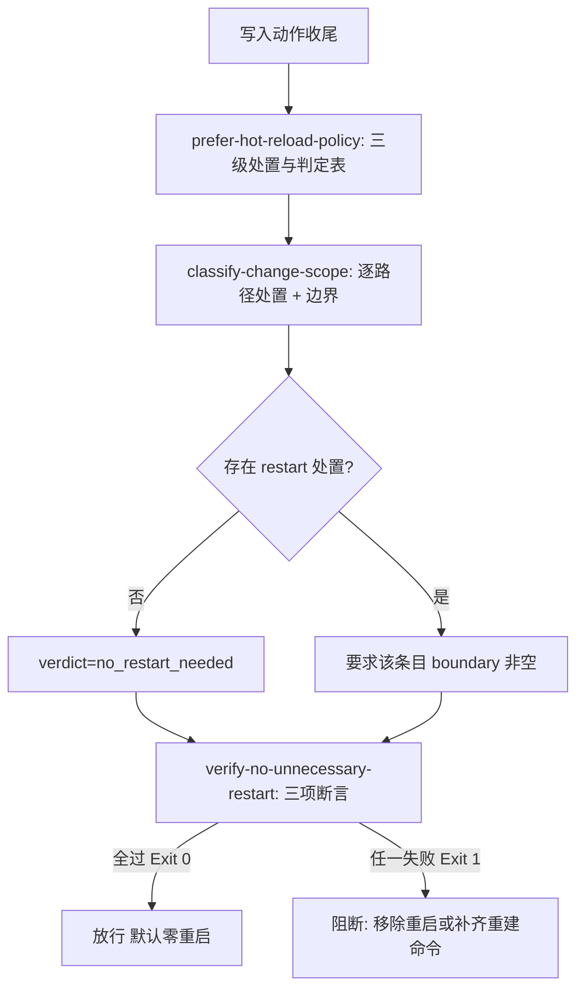

# Zero Restart Guard (零重启写入门禁)

## Overview

本技能是 L3 复合流程级总控，把三块能力积木按依赖顺序串成一道门禁：
`prefer-hot-reload-policy` 定三级处置与判定表 → `classify-change-scope` 逐路径出处置与边界 →
`verify-no-unnecessary-restart` 对重启事件做三项证据断言。
它挂载于管家 **「② 契约与合规」** 集群，是任何写入动作收尾前的「要不要重启」前置门禁。

两条不可让渡的红线：

- **默认目标是零重启**：门禁的起始假设是「不需要重启」，重启是**例外**而非常态；
- **重启必须双向举证**：路径必须落在「不可热更边界」白名单内，且必须同时给出非空重建命令，缺一即阻断。

现实约束（**本仓库不可改范围**）：宿主侧 DSH 应用 bundle、Web 产物与宿主注入的 system prompt 结构确实不可热更，
本门禁不承诺消除它，只承诺**不为它制造额外重启**；仓库内 `skills/**`、`docs/**`、`docs/operations/*.json`、
`bin/skill-pool` 均已实测为「下次读取 / 下次调用即生效」，一律不得重启。

## When to Use

- 任何写入型任务（新增或修改技能、文档、catalog、CLI）收尾准备交付时；
- 交付说明或收尾结论中准备出现「请重启」字样，需要先证明该重启确实落在不可热更边界内时；
- 需要把「不必要重启」与「无证据重启」逐条列出以复盘时。

**触发禁区**：纯只读问答与未产生任何路径改动的任务不经过本门禁；本门禁不授权重启，只授权「有证据的重启」通过，也不评判宿主侧不可热更这一现实约束本身。

## Workflow



1. `[probe:file]` 收集本次写入动作的全部变更路径并逐条归一化，路径不存在也照样登记，形成唯一变更集合；
2. `[probe:regex]` 调用 `classify-change-scope` 逐条判定处置：命中不可热更边界白名单才可为 `restart`，且该条 `boundary` 必须非空；
3. `[probe:length]` 断言 `summary.restart` 计数与「带非空 `boundary` 的 restart 条目数」相等，出现无边界重启即阻断；
4. `[probe:exitcode]` 调用 `verify-no-unnecessary-restart` 对重启事件做三项断言（在变更集合内 / 判定为 restart / 命令非空），退出码非 0 即阻断写入交付；
5. `[probe:exitcode]` 全链路退 0 才放行，并在交付说明中声明本次重启数；`--restarts` 为空或不存在即视为零重启通过。

## Usage & Script

```bash
# 第 1 步：判定本次变更处置（只改仓库内路径 → no_restart_needed）
python3 skills/classify-change-scope/scripts/classify_scope.py \
  --paths skills/dsh-butler/SKILL.md docs/requirements/index.md \
          docs/operations/skill-catalog.json bin/skill-pool --json

# 第 2 步：断言重启证据（零重启记录 → Exit 0）
: > /tmp/restarts-empty.jsonl
python3 skills/verify-no-unnecessary-restart/scripts/verify_no_restart.py \
  --paths skills/prefer-hot-reload-policy/SKILL.md --restarts /tmp/restarts-empty.jsonl --json

# 宿主 bundle 必须重启时：判定为 restart（带 boundary）+ 断言重建命令非空
python3 skills/classify-change-scope/scripts/classify_scope.py \
  --paths "/Applications/DSH Desktop.app/Contents/Resources/app/package.json" --json
printf '{"path":"/Applications/DSH Desktop.app/Contents/Resources/app/package.json","command":"pnpm run rebuild:app","reason":"宿主 bundle 不可热更"}\n' > /tmp/restarts-app.jsonl
python3 skills/verify-no-unnecessary-restart/scripts/verify_no_restart.py \
  --paths "/Applications/DSH Desktop.app/Contents/Resources/app/package.json" \
  --restarts /tmp/restarts-app.jsonl --json
```

## Success Contract

- Exit Code 0：逐路径处置齐备、所有 `restart` 条目带非空边界、重启事件三项断言全过（默认零重启）；
- Exit Code 1：存在不必要重启（判定非 `restart` 却重启）或无证据重启（缺 `boundary` / 缺重建命令），此时**不得交付写入结果**，必须收回重启或补齐证据。

闸门内部两个脚本的退出码语义：`classify-change-scope` 退 1 表示无变更路径可判定；`verify-no-unnecessary-restart` 退 2 表示参数缺失或记录不可解析。

## Boundaries & Constraints

- **默认零重启**：门禁不为「重启」背书，只为「有证据的重启」放行；无重启记录即通过；
- **重启三要素**：路径 + 命中的不可热更边界 + 重建命令，缺一即判为无证据重启，直接阻断；
- **宿主侧不可热更属本仓库不可改范围**：本次验收只覆盖「仓库可见范围内的不必要重启」，不承诺改造 DSH 应用 bundle 与 Web 产物；
- **判定口径唯一**：处置判定只来自 `classify-change-scope`，禁止在门禁层复制第二份判定表；
- **确定性**：全链路纯 Python 3 标准库、字符串驱动判定，禁止随机数、时间戳与网络依赖；
- **不执行命令**：门禁只断言重建命令非空，绝不代为执行宿主侧重建或重启。
