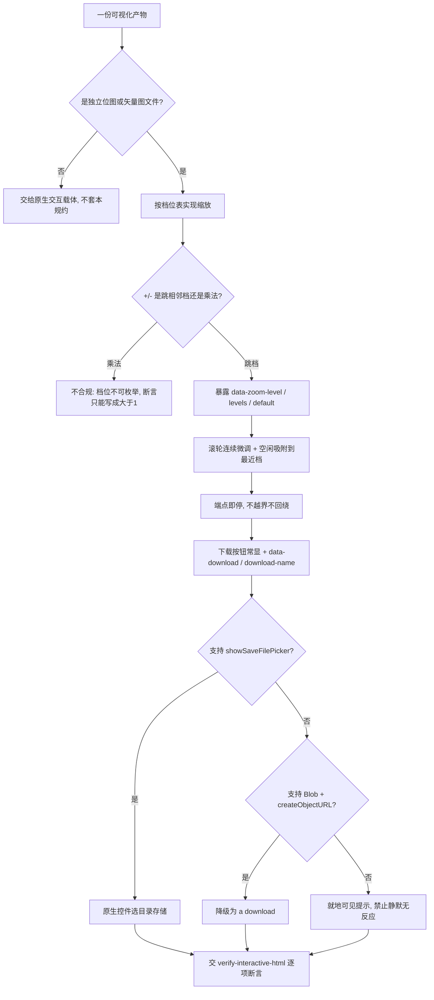

# Zoom Level Policy (可视化产物交互判定基元)

## Overview

本规约是「生成出来的图能被人真正看清、真正存下来」这件事的**唯一口径来源**：
只出定义与判据，不生成文件、不检测。生成交 `build-image-viewer`，断言交 `verify-interactive-html`，
放行交 `visual-interaction-guard`。

本规约同时覆盖两件事，因为它们是**同一份产物契约**：`+`/`−` 怎么缩放、内容怎么存下来。
拆成两条规约会产生两份必然同步漂移的判据。

## 一、离散档位表（缩放口径）

### 1.1 档位表

| 序 | 1 | 2 | 3 | 4 | 5 | 6 | 7 | 8 | 9 | 10 | 11 | 12 | 13 |
| :--- | ---: | ---: | ---: | ---: | ---: | ---: | ---: | ---: | ---: | ---: | ---: | ---: | ---: |
| 倍率 | 0.25 | 0.33 | 0.50 | 0.67 | 0.75 | **1.00** | 1.25 | 1.50 | 2.00 | 3.00 | 4.00 | 6.00 | 8.00 |

**第 6 档（100%）是默认档**，也是复位目标——「复位到哪」只允许有一种解释。

### 1.2 三条行为口径

| # | 口径 | 判据 |
| :---: | :--- | :--- |
| ① | `+` / `−` **跳相邻档**，不做乘法 | 连点 N 次后的倍率必须逐次等于档位表第 `默认序 + N` 档 |
| ② | 滚轮 / 触摸是**连续微调**，松手后**吸附到最近档位** | 存在吸附分支（`data-zoom-snap` 标记），吸附判据按对数距离最近 |
| ③ | 到端点即停，**不越界、不静默回绕** | 在第 1 档再点 `−`、在第 13 档再点 `+`，倍率与档号都不变 |

**为什么必须离散**：连续缩放的档位是**算出来的**，不是**定义出来的**。
点三次得到 `1.728` 倍——这个数字既不可复算也不可断言，用户也无法回答「我现在在第几级」。
只有离散化之后，「点 N 次后必须落在第 6+N 档」才是可复算的断言。

**为什么吸附用对数距离**：缩放是对数感知的。在 0.25 与 0.5 之间取几何中点（0.354）比算术中点（0.375）
更接近「看起来在中间」。用算术距离会让低位档吸附偏移。

### 1.3 机器可读暴露（探针的唯一抓手）

| 属性 | 挂在 | 取值 |
| :--- | :--- | :--- |
| `data-zoom-level` | 档位指示元素 | 存在即代表有档位指示器 |
| `data-zoom-levels` | 同上 | 逗号分隔的倍率表，如 `0.25,0.33,…,8` |
| `data-zoom-default` | 同上 | 默认档倍率，**必须落在表内** |
| `data-zoom-snap` | 同上 | `idle` / `pending` / `snapped`，证明吸附分支真实存在 |
| `data-zoom-current` | 同上 | 当前档序号（1 起） |

指示器文本形态：`<当前档序号>/<总档数> · <百分比>%`，如 `6/13 · 100%`。

## 二、下载三段降级（保存口径）

| 序 | 触发条件 | 行为 | 为什么 |
| :---: | :--- | :--- | :--- |
| ① | 支持 `window.showSaveFilePicker` | 调它，弹出**原生保存控件**，用户在系统控件里选目录与文件名 | 只有它是真正的「拉开目录控件选择存储地址」 |
| ② | 不支持，但支持 `Blob` + `URL.createObjectURL` | 生成 `<a download="<有意义的名字>.<扩展名>">` 并程序化点击 | 保证在旧浏览器上不失去能力，且文件名语义正确 |
| ③ | 都没有 | **就地可见提示**说明原因 | 静默无反应是最坏结果：用户以为坏了，实际是能力缺失 |

**硬约束**：

- 下载按钮必须**常显在工具栏**，不允许藏进菜单或需要先进入某个模式；
- 导出的是**图片本体**，不是再存一份 HTML；
- 文件名扩展名必须落在白名单内：**图片型产物** → `png / jpg / jpeg / svg / webp`；**HTML 海报型产物** → `html`（导出它自己）。白名单按产物类型二分，不允许图片产物导出 HTML、也不允许海报产物只导出一张截图；
- 用户取消（`AbortError`）**不算失败**，但必须有可读反馈；
- 下载走内联 `Blob`，**不得引入任何 http 外链**（与零依赖单文件形态冲突）。

### 2.2 机器可读暴露

| 属性 | 挂在 | 取值 |
| :--- | :--- | :--- |
| `data-download` | 下载按钮 | 存在即代表有下载入口 |
| `data-download-name` | 同上 | 建议文件名（带扩展名），供白名单断言；图片产物给图片扩展名，海报产物给 `html` |

## When to Use

- 任何要交付给用户「看」与「存」的可视化产物（位图、矢量图、图谱、拓扑图、截图）产出前后；
- 判断一份查看器是「连续乘法」还是「离散档位」时；
- 需要写「点 N 次之后倍率是多少」这类可复算断言时；
- 下游 `build-image-viewer` / `verify-interactive-html` 需要引用档位表、吸附判据、降级顺序的唯一真相源时。

**触发禁区**：纯文本、表格、纯 Mermaid 代码块、宿主原生 GenUI 图表不套用本规约；
本规约只出判据，**不生成文件、不做检测、不写盘**。

## Workflow



1. `[probe:regex]` 断言产物含 `data-zoom-level`、`data-zoom-levels`、`data-zoom-default`、`data-zoom-snap` 四个属性，缺任一即判档位未暴露；
2. `[probe:length]` 解析 `data-zoom-levels` 并断言档数 **≥ 5**：少于 5 档说明仍是连续实现；
3. `[probe:regex]` 断言 `data-zoom-default` 的数值**落在档位表内**，不在表内即判复位目标无定义；
4. `[probe:length]` 按档位表复算：连点 `+` N 次的倍率必须逐次等于第 `默认序 + N` 档，任一不等即判仍在做乘法；
5. `[probe:regex]` 断言吸附分支存在（`data-zoom-snap` 出现且取值含 `pending` 与 `snapped` 两种状态），缺任一状态即判吸附未落地；
6. `[probe:length]` 断言端点幂等：在第 1 档取 `−`、第 13 档取 `+`，倍率与档号均不变；
7. `[probe:regex]` 断言产物含 `data-download` 与 `data-download-name`，且后者扩展名落在白名单内（图片型 → 图片扩展名；海报型 → `html`）；
8. `[probe:regex]` 断言下载主路径存在：源码中出现 `showSaveFilePicker` 调用；
9. `[probe:regex]` 断言降级路径存在：源码中同时出现 `createObjectURL` 与 `download`，缺任一即判无该 API 的浏览器上将无反应；
10. `[probe:exitcode]` 全部断言通过交 `verify-interactive-html` 退 0；任一缺失即退 1 并给出逐项明细，禁止带病交付。

## Usage & Script

本规约是纯规约，无独立脚本；档位表与降级顺序由下游两个探针承载：

```bash
# 生成（产物自带档位表与下载按钮）
python3 skills/build-image-viewer/scripts/build_viewer.py --image a.png --out viewer.html

# 断言（26 项：三件套 / 档位 / 吸附 / 下载三段降级 / 零外链）
python3 skills/verify-interactive-html/scripts/verify_html.py --file viewer.html --json
```

实测（13 档产物）：

| 断言 | 结果 |
| :--- | :--- |
| `zoom_levels:count` | 解析到 13 档（要求 ≥ 5） |
| `zoom_default:in_table` | 默认档 1，落在档位表 |
| `api:showSaveFilePicker` | 命中主路径 |
| `fallback:blob-download` | 命中降级路径 |
| `filename:extension-whitelist` | `probe.png`（扩展名 png 在白名单） |

## Success Contract

本规约自身不含脚本，退出码语义由承载脚本给出：

| 退出码 | 含义 |
| :--- | :--- |
| 0 | 26 项断言全过：三件套齐备、档位可枚举且默认档在表内、吸附分支存在、下载三段降级齐备、零外链 |
| 1 | 任一断言失败（缺控制标识 / 档数不足 / 默认档不在表内 / 缺主路径 / 缺降级路径 / 扩展名不在白名单 / 命中外链） |
| 2 | 输入不可读（文件不存在或不可解析） |

## Boundaries & Constraints

- **档位表唯一**：13 档表与默认档（100%）只在本规约定义，禁止下游另立第二套；
- **禁止连续乘法冒充多级**：`+`/`−` 乘法实现的产物，其档位不可枚举，一律判不合规；
- **禁止静默无反应**：下载能力缺失时必须给出可见提示，这是三段降级的第三段存在的理由；
- **导出的是图片本体**：不得导出 HTML 包装，也不得引入外链图床；
- **零外链不可破**：下载与缩放都必须在单文件内完成，`<link>` / `<script src=>` / `http` 外链一律判违规；
- **取消不是失败**：`AbortError` 必须有可读反馈，但不得计入失败；
- **确定性**：档位推进与吸附判据只依赖档位表与当前倍率，禁止随机、禁止依赖系统时间。
