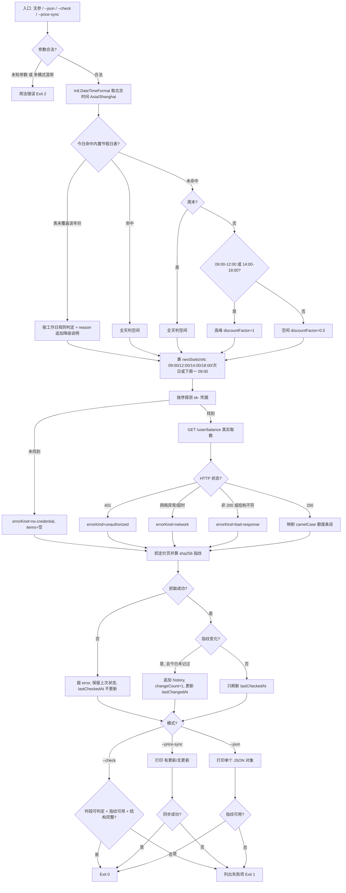

# Probe DeepSeek Usage (DeepSeek 用量探针)

## Overview

本技能回答三个问题，且只用**官方接口事实**回答：

| 问题 | 唯一权威来源 | 取不到时 |
| :--- | :--- | :--- |
| 现在是高峰还是空闲？ | 官方**无**时段接口 → 本地按北京时间算 | 不可能失败（本地算法，永远可判定） |
| 还有多少额度？ | `GET https://api.deepseek.com/user/balance` | 如实报 `errorKind`，`items` 保持空数组 |
| 官方定价页变了吗？ | `https://api-docs.deepseek.com/zh-cn/quick_start/pricing/` 正文 sha256 | 如实报 error 并保留上次状态，不伪造指纹 |

**铁律三条（违反即本技能失效）**：

1. **绝不给假数据**：取不到就报错，禁止占位数字、随机数、估算值冒充余额/时段；
2. **绝不打印/落盘明文密钥**：只输出「是否找到凭据 + 来源名 + 长度」；
3. **官方没有的接口就不臆造**：官方无时段接口、无价格查询 API、不提供节假日日历——
   时段本地算、价位表本地维护（本技能只做文档指纹巡检，不猜价位）、节假日用显式内置表。

## When to Use

- 想知道「现在调用 DeepSeek 是高峰价还是空闲价（空闲价 = 高峰价 × 50%）」；
- 想核对账户余额 / 赠送额度 / 充值额度；
- 想确认官方定价文档有没有偷偷改过（价位表维护的触发信号）；
- 需要把上述三项作为机器可读 JSON 喂给下游脚本或看板时。

**触发禁区**：

- 不判断「该不该用哪个模型」，不做成本预测——那需要本地价位表，不是本技能的职责；
- 不修改任何文件（唯一写入是 `$DSH_HOME/.dsh-control/pricing_fingerprint.json` 状态文件）；
- 不解析 `~/.dsh/.credentials.yaml`（实测那里只有账号令牌，不是 `sk-` Key）。

## Workflow



1. `[probe:regex]` 解析 argv：仅接受 `--json` / `--check` / `--price-sync` / `--help`，未知参数或多模式混用即退 2；
2. `[probe:file]` 用 `Intl.DateTimeFormat(timeZone:"Asia/Shanghai")` 取北京时间，**不依赖服务器本地时区**；
3. `[probe:regex]` 命中内置节假日表（`HOLIDAY_TABLE`，来源：国务院办公厅节假日安排，人工维护）即判全天空闲；年份未覆盖时按工作日规则判定，并在 `reason` 追加「（{年份} 节假日表未覆盖，按工作日规则判定）」，**不静默**；
4. `[probe:time]` 按边界 09:00 / 12:00 / 14:00 / 18:00 算出 `nextSwitchAt`，跨日跨周都要对（周五 18:00 后跳到下周一 09:00，长假跳到节后首个工作日 09:00）；
5. `[probe:exitcode]` 按序探测凭据：`DEEPSEEK_API_KEY` → `DSH_DEEPSEEK_API_KEY` → `./.secrets/deepseek_api_key` → `$DSH_HOME/.dsh-control/deepseek_api_key`；仅接受 `sk-` 开头且长度 ≥ 20 的单行值；
6. `[probe:exitcode]` 真实调用 `GET /user/balance`（`Authorization: Bearer <key>`），错误分类 `no-credential` / `unauthorized` / `network` / `bad-response`；
7. `[probe:file]` 抓定价页正文算 sha256，并记录 `etag` / `last-modified`，写状态文件 `$DSH_HOME/.dsh-control/pricing_fingerprint.json`；
8. `[probe:exitcode]` 按模式输出并以退出码收口：余额缺失**不算失败**，但必须在输出里显式标注 `no-credential`。

## Usage & Script

```bash
# 人类可读中文摘要（当前时段 + 倒计时 + 额度 + 定价指纹状态）
node scripts/deepseek_usage_probe.mjs

# 单个 JSON 对象（字段固定，便于管道消费）
node scripts/deepseek_usage_probe.mjs --json

# 判定：时段可判定 + 指纹可用 + JSON 结构完整
node scripts/deepseek_usage_probe.mjs --check

# 单独触发一次定价指纹同步，打印「有更新 / 无更新」
node scripts/deepseek_usage_probe.mjs --price-sync
```

可复用模块（同目录，ESM，无第三方依赖）：

| 模块 | 关键导出 |
| :--- | :--- |
| `scripts/lib/deepseek_balance.mjs` | `resolveApiKey()`、`describeApiKey()`、`fetchBalance({timeoutMs})`、`credentialSourceNames()`、`maskSecrets(text)` |
| `scripts/lib/pricing_fingerprint.mjs` | `syncPricingFingerprint({timeoutMs,now})`、`readPricingState()`、`pricingStatePath()`、`shanghaiDateKey(date)`、`sha256Hex(text)` |
| `scripts/deepseek_usage_probe.mjs` | `resolvePeriod(date)`、`isWorkday(dateKey)`、`holidayInfo(dateKey)`、`buildProbeResult()`、`checkResult(result)`、`HOLIDAY_TABLE` |

JSON 输出字段（固定，不得增删顶层键）：

```json
{
  "generatedAt": "2026-09-29T02:26:08+08:00",
  "period": "offpeak",
  "periodLabel": "空闲时段",
  "discountFactor": 0.5,
  "nextSwitchAt": "2026-09-29T09:00:00+08:00",
  "nextSwitchInSeconds": 23631,
  "reason": "工作日夜间空闲 18:00-次日 09:00",
  "balance": { "available": false, "source": null, "isAvailable": null, "items": [], "errorKind": "no-credential", "errorMessage": "…" },
  "pricing": { "fingerprint": "5a7b…", "fetchedAt": "…", "changedToday": false, "lastCheckedAt": "…", "sourceUrl": "https://api-docs.deepseek.com/zh-cn/quick_start/pricing/" }
}
```

## Success Contract

| 退出码 | 含义 | 触发条件 |
| :--- | :--- | :--- |
| `0` | 成功 | 报告产出且定价指纹可用（`--check` 为三项判定全过；`--price-sync` 为同步成功） |
| `1` | 判定失败 / 数据不可用 | 定价页抓不到（指纹不可用）、`--check` 任一项失败、`--price-sync` 同步失败 |
| `2` | 用法错误 | 未知参数、多模式混用 |

**余额缺失（`no-credential`）从来不影响退出码**——那是正常降级，不是失败。
`--check` 的判定口径只有三条：**时段可判定 + 指纹可用 + JSON 结构完整**。

## Boundaries & Constraints

- **只信官方源**：余额只走 `api.deepseek.com/user/balance`，指纹只对该官方定价页计算；
  官方没有的接口（时段、价格查询、节假日日历）一律本地补，不臆造端点。
- **绝不给假数据**：抓不到就退 1 报错；`items` 宁可为空数组也不填占位数字；时段是纯本地算法，无需网络。
- **绝不泄漏密钥**：只在内存里用 Key；日志与错误信息经 `maskSecrets()` 把 `sk-…` 打成 `sk-***`；
  状态文件里**只有指纹与响应头**，不含任何凭据。
- **每日一次**：同一天（以 Asia/Shanghai 判定）重复运行只刷新 `lastCheckedAt`，不重复落 `history`；
  `history` 只保留最近 10 次变化的 `{at, from, to}`。
- **幂等**：重复执行不产生重复文件、不改动无关内容；状态文件用「临时文件 + rename」原子写。

## Counterexamples（反例：这些做法一律违规）

| 反例 | 为什么错 | 正确做法 |
| :--- | :--- | :--- |
| 没配 Key 时用「余额：约 0 元」占位 | 假数据，等于骗下游决策 | `items: []` + `errorKind: "no-credential"` |
| 用服务器本地时区判断高峰 | 服务器 UTC 会把 09:00 算成 17:00，折扣算反 | 一律 `timeZone:"Asia/Shanghai"` |
| 把周末当成高峰（「调休上班日」概念混淆） | 官方口径周末全天空闲，与调休无关 | 周末直接判空闲，不看调休上班日 |
| 抓不到定价页就沿用旧指纹并刷新 `lastCheckedAt` | 伪造了「今天校验过」的事实 | 报 error、保留旧状态、`lastCheckedAt` 不动 |
| 输出 `sk-xxxx` 或把 Key 写进状态文件 | 明文密钥落盘/入日志 | 只输出「来源名 + 长度」，其余打码 |
| 年份不在节假日表里就静默按工作日算 | 掩盖了数据缺口，长假会被算成高峰 | `reason` 追加「（{年份} 节假日表未覆盖，按工作日规则判定）」 |
